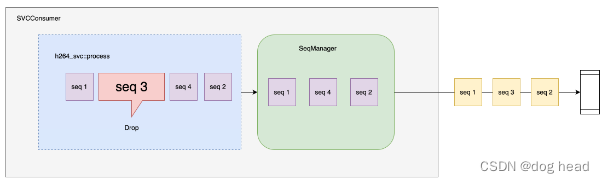
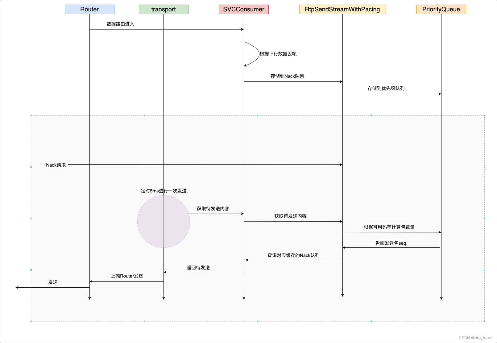

 前面的内容解析了拥塞控制模块，它的作用只是将网络的状况进行及时地反馈以及预测，但是如何在弱网环境下进行可靠传输并没有详细的介绍。当网络传输出现问题（例如：带宽下降、丢包上涨、延迟增加等），那么如何让用户在弱网条件下拥有更好的体验呢？答案是我们降低发送的码率，牺牲观看的清晰度并维持流畅的播放是可行的。下面我们将介绍mediasoup中两种从客户端入手进行码率调整的方案：simulcast 和 SVC（Scalable Video Coding），相关的文档可以浏览mediasoup的官方介绍文档。

# 一、Simulcast
## 1.1 simulcast简介
  simulcast直译过来是多播的意思，其实就是一个客户端发送多条不同码率大小的流，为了达到这样的效果，客户端会对同一帧画面进行不同分辨率的编码来达到降低码率的目的。

 例如上图，推流客户端同时推两路大小不一的流随后在服务器对下行网络进行估计，网络正常时下发720P分辨率的流，网络发生拥塞时下发360P分辨率的流，就能实现码率下降来抵抗弱网。

## 1.2 mediasoup中的Simulcast
  simulcast模块集成在 SimulcastConsumer 类中——SimulcastConsumer.hpp 和 SimulcastConsumer.cpp。下面给出该类的头文件：
```c++
class SimulcastConsumer : public RTC::Consumer, public RTC::RtpStreamSend::Listener
{
public:
	SimulcastConsumer(
	  const std::string& id,
	  const std::string& producerId,
	  RTC::Consumer::Listener* listener,
	  json& data);
	~SimulcastConsumer() override;

public:
	void FillJson(json& jsonObject) const override;
	void FillJsonStats(json& jsonArray) const override;
	void FillJsonScore(json& jsonObject) const override;
	void HandleRequest(Channel::Request* request) override;
	RTC::Consumer::Layers GetPreferredLayers() const override
	{
		RTC::Consumer::Layers layers;

		layers.spatial  = this->preferredSpatialLayer;
		layers.temporal = this->preferredTemporalLayer;

		return layers;
	}
	bool IsActive() const override
	{
		// clang-format off
		return (
			RTC::Consumer::IsActive() &&
			std::any_of(
				this->producerRtpStreams.begin(),
				this->producerRtpStreams.end(),
				[](const RTC::RtpStream* rtpStream)
				{
					return (rtpStream != nullptr && rtpStream->GetScore() > 0u);
				}
			)
		);
		// clang-format on
	}
	void ProducerRtpStream(RTC::RtpStream* rtpStream, uint32_t mappedSsrc) override;
	void ProducerNewRtpStream(RTC::RtpStream* rtpStream, uint32_t mappedSsrc) override;
	void ProducerRtpStreamScore(RTC::RtpStream* rtpStream, uint8_t score, uint8_t previousScore) override;
	void ProducerRtcpSenderReport(RTC::RtpStream* rtpStream, bool first) override;
	uint8_t GetBitratePriority() const override;
	uint32_t IncreaseLayer(uint32_t bitrate, bool considerLoss) override;
	void ApplyLayers() override;
	uint32_t GetDesiredBitrate() const override;
	void SendRtpPacket(RTC::RtpPacket* packet) override;
	void GetRtcp(RTC::RTCP::CompoundPacket* packet, RTC::RtpStreamSend* rtpStream, uint64_t nowMs) override;
	std::vector<RTC::RtpStreamSend*> GetRtpStreams() override
	{
		return this->rtpStreams;
	}
	void NeedWorstRemoteFractionLost(uint32_t mappedSsrc, uint8_t& worstRemoteFractionLost) override;
	void ReceiveNack(RTC::RTCP::FeedbackRtpNackPacket* nackPacket) override;
	void ReceiveKeyFrameRequest(RTC::RTCP::FeedbackPs::MessageType messageType, uint32_t ssrc) override;
	void ReceiveRtcpReceiverReport(RTC::RTCP::ReceiverReport* report) override;
	uint32_t GetTransmissionRate(uint64_t nowMs) override;
	float GetRtt() const override;

private:
	void UserOnTransportConnected() override;
	void UserOnTransportDisconnected() override;
	void UserOnPaused() override;
	void UserOnResumed() override;
	void CreateRtpStream();
	void RequestKeyFrames();
	void RequestKeyFrameForTargetSpatialLayer();
	void RequestKeyFrameForCurrentSpatialLayer();
	void MayChangeLayers(bool force = false);
	bool RecalculateTargetLayers(int16_t& newTargetSpatialLayer, int16_t& newTargetTemporalLayer) const;
	void UpdateTargetLayers(int16_t newTargetSpatialLayer, int16_t newTargetTemporalLayer);
	bool CanSwitchToSpatialLayer(int16_t spatialLayer) const;
	void EmitScore() const;
	void EmitLayersChange() const;
	RTC::RtpStream* GetProducerCurrentRtpStream() const;
	RTC::RtpStream* GetProducerTargetRtpStream() const;
	RTC::RtpStream* GetProducerTsReferenceRtpStream() const;

	/* Pure virtual methods inherited from RtpStreamSend::Listener. */
public:
	void OnRtpStreamScore(RTC::RtpStream* rtpStream, uint8_t score, uint8_t previousScore) override;
	void OnRtpStreamRetransmitRtpPacket(RTC::RtpStreamSend* rtpStream, RTC::RtpPacket* packet) override;

private:
	// Allocated by this.
	RTC::RtpStreamSend* rtpStream{ nullptr };
	// Others.
	std::unordered_map<uint32_t, int16_t> mapMappedSsrcSpatialLayer;
	std::vector<RTC::RtpStreamSend*> rtpStreams;
	std::vector<RTC::RtpStream*> producerRtpStreams; // Indexed by spatial layer.
	bool syncRequired{ false };
	RTC::SeqManager<uint16_t> rtpSeqManager;
	int16_t preferredSpatialLayer{ -1 };
	int16_t preferredTemporalLayer{ -1 };
	int16_t provisionalTargetSpatialLayer{ -1 };
	int16_t provisionalTargetTemporalLayer{ -1 };
	int16_t targetSpatialLayer{ -1 };
	int16_t targetTemporalLayer{ -1 };
	int16_t currentSpatialLayer{ -1 };
	int16_t tsReferenceSpatialLayer{ -1 }; // Used for RTP TS sync.
	std::unique_ptr<RTC::Codecs::EncodingContext> encodingContext;
	uint32_t tsOffset{ 0u }; // RTP Timestamp offset.
	bool keyFrameForTsOffsetRequested{ false };
	uint64_t lastBweDowngradeAtMs{ 0u }; // Last time we moved to lower spatial layer due to BWE.
};

```
这里需要提到成员命名中的空间层和时间层的概念，码率其实是一个数据大小与时间的比值，那么是两个维度的衡量值，因此我们控制发送码率可以通过两个维度去调整，一个是空间层级、一个是时间层级。与空间强相关的就是我们的分辨率——也就是每张图片的大小，而与时间强相关的则是帧率——也就是每秒多少张图，这样我们就可以控制流的大小了。
  而代码中关键成员为下列几个（我们可以直接理解空间为分辨率标志，时间为帧率标志）：
    空间层级：currentSpatialLayer（当前大小）、targetSpatialLayer（目标大小）、preferredSpatialLayer（最佳大小）、provisionalTargetSpatialLayer（临时大小）、tsReferenceSpatialLayer（参考空间）；
    时间层级：preferredTemporalLayer（最佳时间）、provisionalTargetTemporalLayer（参考时间）、targetTemporalLayer（目标时间）。

  以上的成员作为 producerRtpStreams 管理的标识来对流进行分辨，当有新的流生成时，会根据流中的参数放到producerRtpStreams中等待切换。具体代码如下：
```c++
void SimulcastConsumer::ProducerRtpStream(RTC::RtpStream* rtpStream, uint32_t mappedSsrc)
{
	MS_TRACE();

	auto it = this->mapMappedSsrcSpatialLayer.find(mappedSsrc);
	MS_ASSERT(it != this->mapMappedSsrcSpatialLayer.end(), "unknown mappedSsrc");

	int16_t spatialLayer = it->second;
	this->producerRtpStreams[spatialLayer] = rtpStream;
}

void SimulcastConsumer::ProducerNewRtpStream(RTC::RtpStream* rtpStream, uint32_t mappedSsrc)
{
	MS_TRACE();

	auto it = this->mapMappedSsrcSpatialLayer.find(mappedSsrc);
	MS_ASSERT(it != this->mapMappedSsrcSpatialLayer.end(), "unknown mappedSsrc");

	int16_t spatialLayer = it->second;

	this->producerRtpStreams[spatialLayer] = rtpStream;

	// Emit the score event.
	EmitScore();

	if (IsActive())
		MayChangeLayers();
}

void SimulcastConsumer::ProducerRtpStreamScore(
  RTC::RtpStream* /*rtpStream*/, uint8_t score, uint8_t previousScore)
{
	MS_TRACE();

	// Emit the score event.
	EmitScore();

	if (RTC::Consumer::IsActive())
	{
		// Just check target layers if the stream has died or reborned.
		// clang-format off
		if (
			!this->externallyManagedBitrate ||
			(score == 0u || previousScore == 0u)
		)
		// clang-format on
		{
			MayChangeLayers();
		}
	}
}

```
流存储结束后我们分析一下发送rtp数据的流程。在之前的文章中提到的拥塞控制模块中的TransportCongestionControlClient类是服务端中控制发送的部分。我们直接从feedback然后带宽估计完成后进行解析。当带宽估计完成，我们的目标码率和当前码率出现差异时将会进行下面的函数调用。
```c++
void TransportCongestionControlClient::MayEmitAvailableBitrateEvent(uint32_t previousAvailableBitrate)
{
	MS_TRACE();

	uint64_t nowMs = DepLibUV::GetTimeMsInt64();
	bool notify{ false };

	// Ignore if first event.
	// NOTE: Otherwise it will make the Transport crash since this event also happens
	// during the constructor of this class.
	if (this->lastAvailableBitrateEventAtMs == 0u)
	{
		this->lastAvailableBitrateEventAtMs = nowMs;
		return;
	}

	// Emit if this is the first valid event.
	if (!this->availableBitrateEventCalled)
	{
		this->availableBitrateEventCalled = true;
		notify = true;
	}
	// Emit event if AvailableBitrateEventInterval elapsed.
	else if (nowMs - this->lastAvailableBitrateEventAtMs >= AvailableBitrateEventInterval)
	{
		notify = true;
	}
	// Also emit the event fast if we detect a high BWE value decrease.
	else if (this->bitrates.availableBitrate < previousAvailableBitrate * 0.75)
	{
		MS_WARN_TAG(
		  bwe,
		  "high BWE value decrease detected, notifying the listener [now:%" PRIu32 ", before:%" PRIu32
		  "]",
		  this->bitrates.availableBitrate,
		  previousAvailableBitrate);

		notify = true;
	}
	// Also emit the event fast if we detect a high BWE value increase.
	else if (this->bitrates.availableBitrate > previousAvailableBitrate * 1.50)
	{
		MS_DEBUG_TAG(
		  bwe,
		  "high BWE value increase detected, notifying the listener [now:%" PRIu32 ", before:%" PRIu32 "]",
		  this->bitrates.availableBitrate,
		  previousAvailableBitrate);

		notify = true;
	}

	if (notify)
	{
		MS_DEBUG_DEV(
		  "notifying the listener with new available bitrate:%" PRIu32,
		  this->bitrates.availableBitrate);

		this->lastAvailableBitrateEventAtMs = nowMs;

		this->listener->OnTransportCongestionControlClientBitrates(this, this->bitrates);
	}
}

```

上述代码中主要干了码率增大减小时是否变更码流的阈值判断，思想就是：当码率在2s内迅速减小到75%时切换小码率、2s内码率增大到150%时切换大码率。意味着在上调码率上更为保守可以保证流畅传输，不至于因为网络传输的波动而导致来回切换。当上述的判断结束后，就会进入传输控制类的码率调整的方法中：
```c
inline void Transport::OnTransportCongestionControlClientBitrates(
  RTC::TransportCongestionControlClient* /*tccClient*/,
  RTC::TransportCongestionControlClient::Bitrates& bitrates)
{
	MS_TRACE();

	MS_DEBUG_DEV("outgoing available bitrate:%" PRIu32, bitrates.availableBitrate);

	DistributeAvailableOutgoingBitrate();
	ComputeOutgoingDesiredBitrate();

	// May emit 'trace' event.
	EmitTraceEventBweType(bitrates);
}
```

Transport类管理的所有传输控制的内容，算是一个中介者。在DistributeAvailableOutgoingBitrate函数中对切换流的具体内容进行了控制：

```c
void Transport::DistributeAvailableOutgoingBitrate()
{
	MS_TRACE();

	MS_ASSERT(this->tccClient, "no TransportCongestionClient");

	std::multimap<uint8_t, RTC::Consumer*> multimapPriorityConsumer;

	// Fill the map with Consumers and their priority (if > 0).
	for (auto& kv : this->mapConsumers)
	{
		auto* consumer = kv.second;
		auto priority  = consumer->GetBitratePriority();

		if (priority > 0u)
			multimapPriorityConsumer.emplace(priority, consumer);
	}

	// Nobody wants bitrate. Exit.
	if (multimapPriorityConsumer.empty())
		return;

	uint32_t availableBitrate = this->tccClient->GetAvailableBitrate();

	this->tccClient->RescheduleNextAvailableBitrateEvent();

	MS_DEBUG_DEV("before layer-by-layer iterations [availableBitrate:%" PRIu32 "]", availableBitrate);

	// Redistribute the available bitrate by allowing Consumers to increase
	// layer by layer. Take into account the priority of each Consumer to
	// provide it with more bitrate.
	while (availableBitrate > 0u)
	{
		auto previousAvailableBitrate = availableBitrate;

		for (auto it = multimapPriorityConsumer.rbegin(); it != multimapPriorityConsumer.rend(); ++it)
		{
			auto priority  = it->first;
			auto* consumer = it->second;
			auto bweType   = this->tccClient->GetBweType();

			// If a Consumer has priority > 1, call IncreaseLayer() more times to
			// provide it with more available bitrate to choose its preferred layers.
			for (uint8_t i{ 1u }; i <= priority; ++i)
			{
				uint32_t usedBitrate;

				switch (bweType)
				{
					case RTC::BweType::TRANSPORT_CC:
						usedBitrate = consumer->IncreaseLayer(availableBitrate, /*considerLoss*/ false);
						break;
					case RTC::BweType::REMB:
						usedBitrate = consumer->IncreaseLayer(availableBitrate, /*considerLoss*/ true);
						break;
				}

				MS_ASSERT(usedBitrate <= availableBitrate, "Consumer used more layer bitrate than given");

				availableBitrate -= usedBitrate;

				// Exit the loop fast if used bitrate is 0.
				if (usedBitrate == 0u)
					break;
			}
		}

		// If no Consumer used bitrate, exit the loop.
		if (availableBitrate == previousAvailableBitrate)
			break;
	}

	MS_DEBUG_DEV("after layer-by-layer iterations [availableBitrate:%" PRIu32 "]", availableBitrate);

	// Finally instruct Consumers to apply their computed layers.
	for (auto it = multimapPriorityConsumer.rbegin(); it != multimapPriorityConsumer.rend(); ++it)
	{
		auto* consumer = it->second;

		consumer->ApplyLayers();
	}
}

```

把待切换的码率通过关联的 consumer 类成员传入 IncreaseLayer。
```c
uint32_t SimulcastConsumer::IncreaseLayer(uint32_t bitrate, bool considerLoss)
{
	MS_TRACE();

	MS_ASSERT(this->externallyManagedBitrate, "bitrate is not externally managed");
	MS_ASSERT(IsActive(), "should be active");

	// If already in the preferred layers, do nothing.
	// clang-format off
	if (
		this->provisionalTargetSpatialLayer == this->preferredSpatialLayer &&
		this->provisionalTargetTemporalLayer == this->preferredTemporalLayer
	)
	// clang-format on
	{
		return 0u;
	}

	uint32_t virtualBitrate;

	if (considerLoss)
	{
		// Calculate virtual available bitrate based on given bitrate and our
		// packet lost.
		auto lossPercentage = this->rtpStream->GetLossPercentage();

		if (lossPercentage < 2)
			virtualBitrate = 1.08 * bitrate;
		else if (lossPercentage > 10)
			virtualBitrate = (1 - 0.5 * (lossPercentage / 100)) * bitrate;
		else
			virtualBitrate = bitrate;
	}
	else
	{
		virtualBitrate = bitrate;
	}

	uint32_t requiredBitrate{ 0u };
	int16_t spatialLayer{ 0 };
	int16_t temporalLayer{ 0 };
	auto nowMs = DepLibUV::GetTimeMs();

	for (size_t sIdx{ 0u }; sIdx < this->producerRtpStreams.size(); ++sIdx)
	{
		spatialLayer = static_cast<int16_t>(sIdx);

		// If this is higher than current spatial layer and we moved to to current spatial
		// layer due to BWE limitations, check how much it has elapsed since then.
		if (nowMs - this->lastBweDowngradeAtMs < BweDowngradeConservativeMs)
		{
			if (this->provisionalTargetSpatialLayer > -1 && spatialLayer > this->currentSpatialLayer)
			{
				MS_DEBUG_DEV(
				  "avoid upgrading to spatial layer %" PRIi16 " due to recent BWE downgrade", spatialLayer);

				goto done;
			}
		}

		// Ignore spatial layers lower than the one we already have.
		if (spatialLayer < this->provisionalTargetSpatialLayer)
			continue;

		// This can be null.
		auto* producerRtpStream = this->producerRtpStreams.at(spatialLayer);

		// Producer stream does not exist or it's not good. Ignore.
		if (!producerRtpStream || producerRtpStream->GetScore() < StreamGoodScore)
			continue;

		// If the stream has not been active time enough and we have an active one
		// already, move to the next spatial layer.
		// clang-format off
		if (
			spatialLayer != this->provisionalTargetSpatialLayer &&
			this->provisionalTargetSpatialLayer != -1 &&
			producerRtpStream->GetActiveMs() < StreamMinActiveMs
		)
		// clang-format on
		{
			continue;
		}

		// We may not yet switch to this spatial layer.
		if (!CanSwitchToSpatialLayer(spatialLayer))
			continue;

		temporalLayer = 0;

		// Check bitrate of every temporal layer.
		for (; temporalLayer < producerRtpStream->GetTemporalLayers(); ++temporalLayer)
		{
			// Ignore temporal layers lower than the one we already have (taking into account
			// the spatial layer too).
			// clang-format off
			if (
				spatialLayer == this->provisionalTargetSpatialLayer &&
				temporalLayer <= this->provisionalTargetTemporalLayer
			)
			// clang-format on
			{
				continue;
			}

			requiredBitrate = producerRtpStream->GetLayerBitrate(nowMs, 0, temporalLayer);

			// This is simulcast so we must substract the bitrate of the current temporal
			// spatial layer if this is the temporal layer 0 of a higher spatial layer.
			//
			// clang-format off
			if (
				requiredBitrate &&
				temporalLayer == 0 &&
				this->provisionalTargetSpatialLayer > -1 &&
				spatialLayer > this->provisionalTargetSpatialLayer
			)
			// clang-format on
			{
				auto* provisionalProducerRtpStream =
				  this->producerRtpStreams.at(this->provisionalTargetSpatialLayer);
				auto provisionalRequiredBitrate = provisionalProducerRtpStream->GetLayerBitrate(
				  nowMs, 0, this->provisionalTargetTemporalLayer);

				if (requiredBitrate > provisionalRequiredBitrate)
					requiredBitrate -= provisionalRequiredBitrate;
				else
					requiredBitrate = 1u; // Don't set 0 since it would be ignored.
			}

			MS_DEBUG_DEV(
			  "testing layers %" PRIi16 ":%" PRIi16 " [virtual bitrate:%" PRIu32
			  ", required bitrate:%" PRIu32 "]",
			  spatialLayer,
			  temporalLayer,
			  virtualBitrate,
			  requiredBitrate);

			// If active layer, end iterations here. Otherwise move to next spatial layer.
			if (requiredBitrate)
				goto done;
			else
				break;
		}

		// If this is the preferred or higher spatial layer, take it and exit.
		if (spatialLayer >= this->preferredSpatialLayer)
			break;
	}

done:

	// No higher active layers found.
	if (!requiredBitrate)
		return 0u;

	// No luck.
	if (requiredBitrate > virtualBitrate)
		return 0u;

	// Set provisional layers.
	this->provisionalTargetSpatialLayer  = spatialLayer;
	this->provisionalTargetTemporalLayer = temporalLayer;

	MS_DEBUG_DEV(
	  "setting provisional layers to %" PRIi16 ":%" PRIi16 " [virtual bitrate:%" PRIu32
	  ", required bitrate:%" PRIu32 "]",
	  this->provisionalTargetSpatialLayer,
	  this->provisionalTargetTemporalLayer,
	  virtualBitrate,
	  requiredBitrate);

	if (requiredBitrate <= bitrate)
		return requiredBitrate;
	else if (requiredBitrate <= virtualBitrate)
		return bitrate;
	else
		return requiredBitrate; // NOTE: This cannot happen.
}

```

而这个函数是对层级的切换控制函数，主要思想是：通过对流的评分系统来挑选出一个适合的流，然后把流切换到目标中。最后是调用SendRtpPacket函数发送完成。

## 1.3 Simulcast的缺陷
  虽然Simulcast可以解决下行带宽不足时降码率的需求，但是在应用的过程中存在比较致命的缺陷：
  1.上行带宽的增加，我们在上行时会多发送多条流，导致大量的带宽浪费。而为了应对几个下行网络较差的用户而牺牲上行用户的带宽资源，这样的做法有待商榷；
  2.下行可供的流选择性很少，及时使用3条流同时传输的方式，在移动网络这样复杂多变的网络条件下，上下调整的幅度将会是巨大的，会造成不好的用户体验，相比SVC适用性较差。

# 二、SVC
## 2.1 SVC简介
  可伸缩视频编码SVC（Scalable Video Coding）技术是H.264标准的一个扩展，最初由JVT在2004年开始制定。H.264 SVC是H.264标准的扩展部分，SVC扩展部分引入了一种传统H.264 AVC不存在的概念——编码流中的层。基本层编码最低层的时域、空域和质量流；增强层以基本层作为起始点，对附加信息进行，从而在解码过程中重构更高层的质量、分辨率和时域层。通过解码基本层和相邻增强层，解码器能生成特定层的视频流。

## 2.2 mediasoup中的SVC
  得益于mediasoup良好的模块分化，SVC模块和上述的simulcast模块的实现类似。
```c++
class SvcConsumer : public RTC::Consumer, public RTC::RtpStreamSend::Listener
{
public:
	SvcConsumer(
	  const std::string& id,
	  const std::string& producerId,
	  RTC::Consumer::Listener* listener,
	  json& data);
	~SvcConsumer() override;

public:
	void FillJson(json& jsonObject) const override;
	void FillJsonStats(json& jsonArray) const override;
	void FillJsonScore(json& jsonObject) const override;
	void HandleRequest(Channel::ChannelRequest* request) override;
	RTC::Consumer::Layers GetPreferredLayers() const override
	{
		RTC::Consumer::Layers layers;

		layers.spatial  = this->preferredSpatialLayer;
		layers.temporal = this->preferredTemporalLayer;

		return layers;
	}
	bool IsActive() const override
	{
		// clang-format off
		return (
			RTC::Consumer::IsActive() &&
			this->producerRtpStream &&
			(this->producerRtpStream->GetScore() > 0u || this->producerRtpStream->HasDtx())
		);
		// clang-format on
	}
	void ProducerRtpStream(RTC::RtpStream* rtpStream, uint32_t mappedSsrc) override;
	void ProducerNewRtpStream(RTC::RtpStream* rtpStream, uint32_t mappedSsrc) override;
	void ProducerRtpStreamScore(RTC::RtpStream* rtpStream, uint8_t score, uint8_t previousScore) override;
	void ProducerRtcpSenderReport(RTC::RtpStream* rtpStream, bool first) override;
	uint8_t GetBitratePriority() const override;
	uint32_t IncreaseLayer(uint32_t bitrate, bool considerLoss) override;
	void ApplyLayers() override;
	uint32_t GetDesiredBitrate() const override;
	void SendRtpPacket(RTC::RtpPacket* packet) override;
	void GetRtcp(RTC::RTCP::CompoundPacket* packet, RTC::RtpStreamSend* rtpStream, uint64_t nowMs) override;
	std::vector<RTC::RtpStreamSend*> GetRtpStreams() override
	{
		return this->rtpStreams;
	}
	void NeedWorstRemoteFractionLost(uint32_t mappedSsrc, uint8_t& worstRemoteFractionLost) override;
	void ReceiveNack(RTC::RTCP::FeedbackRtpNackPacket* nackPacket) override;
	void ReceiveKeyFrameRequest(RTC::RTCP::FeedbackPs::MessageType messageType, uint32_t ssrc) override;
	void ReceiveRtcpReceiverReport(RTC::RTCP::ReceiverReport* report) override;
	uint32_t GetTransmissionRate(uint64_t nowMs) override;
	float GetRtt() const override;

private:
	void UserOnTransportConnected() override;
	void UserOnTransportDisconnected() override;
	void UserOnPaused() override;
	void UserOnResumed() override;
	void CreateRtpStream();
	void RequestKeyFrame();
	void MayChangeLayers(bool force = false);
	bool RecalculateTargetLayers(int16_t& newTargetSpatialLayer, int16_t& newTargetTemporalLayer) const;
	void UpdateTargetLayers(int16_t newTargetSpatialLayer, int16_t newTargetTemporalLayer);
	void EmitScore() const;
	void EmitLayersChange() const;

	/* Pure virtual methods inherited from RtpStreamSend::Listener. */
public:
	void OnRtpStreamScore(RTC::RtpStream* rtpStream, uint8_t score, uint8_t previousScore) override;
	void OnRtpStreamRetransmitRtpPacket(RTC::RtpStreamSend* rtpStream, RTC::RtpPacket* packet) override;

private:
	// Allocated by this.
	RTC::RtpStreamSend* rtpStream{ nullptr };
	// Others.
	std::vector<RTC::RtpStreamSend*> rtpStreams;
	RTC::RtpStream* producerRtpStream{ nullptr };
	bool syncRequired{ false };
	RTC::SeqManager<uint16_t> rtpSeqManager;
	int16_t preferredSpatialLayer{ -1 };
	int16_t preferredTemporalLayer{ -1 };
	int16_t provisionalTargetSpatialLayer{ -1 };
	int16_t provisionalTargetTemporalLayer{ -1 };
	std::unique_ptr<RTC::Codecs::EncodingContext> encodingContext;
	uint64_t lastBweDowngradeAtMs{ 0u }; // Last time we moved to lower spatial layer due to BWE.
};
```
与simulcast类似的分层概念也应用到了svc模块中。

而SVC的producer会在创建的时候和simulcast一样，根据传入的rtpParameters来创建。随后走层级切换的逻辑来进行传输：
```c++
void SvcConsumer::ApplyLayers()
{
	MS_TRACE();

	MS_ASSERT(this->externallyManagedBitrate, "bitrate is not externally managed");
	MS_ASSERT(IsActive(), "should be active");

	auto provisionalTargetSpatialLayer  = this->provisionalTargetSpatialLayer;
	auto provisionalTargetTemporalLayer = this->provisionalTargetTemporalLayer;

	// Reset provisional target layers.
	this->provisionalTargetSpatialLayer  = -1;
	this->provisionalTargetTemporalLayer = -1;

	if (!IsActive())
		return;

	// clang-format off
	if (
		provisionalTargetSpatialLayer != this->encodingContext->GetTargetSpatialLayer() ||
		provisionalTargetTemporalLayer != this->encodingContext->GetTargetTemporalLayer()
	)
	// clang-format on
	{
		UpdateTargetLayers(provisionalTargetSpatialLayer, provisionalTargetTemporalLayer);

		// If this looks like a spatial layer downgrade due to BWE limitations, set member.
		// clang-format off
		if (
			this->rtpStream->GetActiveMs() > BweDowngradeMinActiveMs &&
			this->encodingContext->GetTargetSpatialLayer() < this->encodingContext->GetCurrentSpatialLayer() &&
			this->encodingContext->GetCurrentSpatialLayer() <= this->preferredSpatialLayer
		)
		// clang-format on
		{
			MS_DEBUG_DEV(
			  "possible target spatial layer downgrade (from %" PRIi16 " to %" PRIi16
			  ") due to BWE limitation",
			  this->encodingContext->GetCurrentSpatialLayer(),
			  this->encodingContext->GetTargetSpatialLayer());

			this->lastBweDowngradeAtMs = DepLibUV::GetTimeMs();
		}
	}
}

...

uint32_t SvcConsumer::IncreaseLayer(uint32_t bitrate, bool considerLoss)
{
	MS_TRACE();

	MS_ASSERT(this->externallyManagedBitrate, "bitrate is not externally managed");
	MS_ASSERT(IsActive(), "should be active");

	if (this->producerRtpStream->GetScore() == 0u)
		return 0u;

	// If already in the preferred layers, do nothing.
	// clang-format off
	if (
		this->provisionalTargetSpatialLayer == this->preferredSpatialLayer &&
		this->provisionalTargetTemporalLayer == this->preferredTemporalLayer
	)
	// clang-format on
	{
		return 0u;
	}

	uint32_t virtualBitrate;

	if (considerLoss)
	{
		// Calculate virtual available bitrate based on given bitrate and our
		// packet lost.
		auto lossPercentage = this->rtpStream->GetLossPercentage();

		if (lossPercentage < 2)
			virtualBitrate = 1.08 * bitrate;
		else if (lossPercentage > 10)
			virtualBitrate = (1 - 0.5 * (lossPercentage / 100)) * bitrate;
		else
			virtualBitrate = bitrate;
	}
	else
	{
		virtualBitrate = bitrate;
	}

	uint32_t requiredBitrate{ 0u };
	int16_t spatialLayer{ 0 };
	int16_t temporalLayer{ 0 };
	auto nowMs = DepLibUV::GetTimeMs();

	for (; spatialLayer < this->producerRtpStream->GetSpatialLayers(); ++spatialLayer)
	{
		// If this is higher than current spatial layer and we moved to to current spatial
		// layer due to BWE limitations, check how much it has elapsed since then.
		if (nowMs - this->lastBweDowngradeAtMs < BweDowngradeConservativeMs)
		{
			if (this->provisionalTargetSpatialLayer > -1 && spatialLayer > this->encodingContext->GetCurrentSpatialLayer())
			{
				MS_DEBUG_DEV(
				  "avoid upgrading to spatial layer %" PRIi16 " due to recent BWE downgrade", spatialLayer);

				goto done;
			}
		}

		// Ignore spatial layers lower than the one we already have.
		if (spatialLayer < this->provisionalTargetSpatialLayer)
			continue;

		temporalLayer = 0;

		// Check bitrate of every temporal layer.
		for (; temporalLayer < this->producerRtpStream->GetTemporalLayers(); ++temporalLayer)
		{
			// Ignore temporal layers lower than the one we already have (taking into account
			// the spatial layer too).
			// clang-format off
			if (
				spatialLayer == this->provisionalTargetSpatialLayer &&
				temporalLayer <= this->provisionalTargetTemporalLayer
			)
			// clang-format on
			{
				continue;
			}

			requiredBitrate =
			  this->producerRtpStream->GetLayerBitrate(nowMs, spatialLayer, temporalLayer);

			MS_DEBUG_DEV(
			  "testing layers %" PRIi16 ":%" PRIi16 " [virtual bitrate:%" PRIu32
			  ", required bitrate:%" PRIu32 "]",
			  spatialLayer,
			  temporalLayer,
			  virtualBitrate,
			  requiredBitrate);

			// If active layer, end iterations here. Otherwise move to next spatial layer.
			if (requiredBitrate)
				goto done;
			else
				break;
		}

		// If this is the preferred or higher spatial layer, take it and exit.
		if (spatialLayer >= this->preferredSpatialLayer)
			break;
	}

done:

	// No higher active layers found.
	if (!requiredBitrate)
		return 0u;

	// No luck.
	if (requiredBitrate > virtualBitrate)
		return 0u;

	// Set provisional layers.
	this->provisionalTargetSpatialLayer  = spatialLayer;
	this->provisionalTargetTemporalLayer = temporalLayer;

	MS_DEBUG_DEV(
	  "upgrading to layers %" PRIi16 ":%" PRIi16 " [virtual bitrate:%" PRIu32
	  ", required bitrate:%" PRIu32 "]",
	  this->provisionalTargetSpatialLayer,
	  this->provisionalTargetTemporalLayer,
	  virtualBitrate,
	  requiredBitrate);

	if (requiredBitrate <= bitrate)
		return requiredBitrate;
	else if (requiredBitrate <= virtualBitrate)
		return bitrate;
	else
		return requiredBitrate; // NOTE: This cannot happen.
}

void SvcConsumer::ApplyLayers()
{
	MS_TRACE();

	MS_ASSERT(this->externallyManagedBitrate, "bitrate is not externally managed");
	MS_ASSERT(IsActive(), "should be active");

	auto provisionalTargetSpatialLayer  = this->provisionalTargetSpatialLayer;
	auto provisionalTargetTemporalLayer = this->provisionalTargetTemporalLayer;

	// Reset provisional target layers.
	this->provisionalTargetSpatialLayer  = -1;
	this->provisionalTargetTemporalLayer = -1;

	if (!IsActive())
		return;

	// clang-format off
	if (
		provisionalTargetSpatialLayer != this->encodingContext->GetTargetSpatialLayer() ||
		provisionalTargetTemporalLayer != this->encodingContext->GetTargetTemporalLayer()
	)
	// clang-format on
	{
		UpdateTargetLayers(provisionalTargetSpatialLayer, provisionalTargetTemporalLayer);

		// If this looks like a spatial layer downgrade due to BWE limitations, set member.
		// clang-format off
		if (
			this->rtpStream->GetActiveMs() > BweDowngradeMinActiveMs &&
			this->encodingContext->GetTargetSpatialLayer() < this->encodingContext->GetCurrentSpatialLayer() &&
			this->encodingContext->GetCurrentSpatialLayer() <= this->preferredSpatialLayer
		)
		// clang-format on
		{
			MS_DEBUG_DEV(
			  "possible target spatial layer downgrade (from %" PRIi16 " to %" PRIi16
			  ") due to BWE limitation",
			  this->encodingContext->GetCurrentSpatialLayer(),
			  this->encodingContext->GetTargetSpatialLayer());

			this->lastBweDowngradeAtMs = DepLibUV::GetTimeMs();
		}
	}
}

```
# 三、结语
  本文只是对mediasoup的simulcast和SVC的层级进行简单的介绍，后面会对simulcast或者svc整体应用的过程（包括：创建、传输、拥塞控制交互进行分析）。

## 细节1：数据包的类型怎么区分？
  WebRTC的Rtp数据除了根据PT进行区分，还会使用扩展字段去做一些额外的信息携带。在mediasoup中，Rtp数据来到Producer后会立刻进入前处理函数——PreProcessRtpPacket——一旦是Video数据就会打上 frameMarking07、frameMarking 这两个扩展字段。
```c++
// src/RTC/Producer.cpp
...
	inline void Producer::PreProcessRtpPacket(RTC::RtpPacket* packet)
	{
		MS_TRACE();

		if (this->kind == RTC::Media::Kind::VIDEO)
		{
			// NOTE: Remove this once framemarking draft becomes RFC.
			packet->SetFrameMarking07ExtensionId(this->rtpHeaderExtensionIds.frameMarking07);
			packet->SetFrameMarkingExtensionId(this->rtpHeaderExtensionIds.frameMarking);
		}
	}
...
```
打完扩展字段的标识我们就可以在RtpStreamRecv这个位置给每个包创建payloadDescriptorHandler（载荷描述处理能力）。
```c++
// src/RTC/RtpStreamRecv.cpp
...
bool RtpStreamRecv::ReceivePacket(RTC::RtpPacket* packet)
{
	...
	
	// Process the packet at codec level.
	if (packet->GetPayloadType() == GetPayloadType())
		RTC::Codecs::Tools::ProcessRtpPacket(packet, GetMimeType());

	...
}
...

// include/RTC/Codecs/Tools.hpp
static void ProcessRtpPacket(RTC::RtpPacket* packet, const RTC::RtpCodecMimeType& mimeType)
{
	switch (mimeType.type)
	{
		case RTC::RtpCodecMimeType::Type::VIDEO:
		{
			switch (mimeType.subtype)
			{
				case RTC::RtpCodecMimeType::Subtype::VP8:
				{
					RTC::Codecs::VP8::ProcessRtpPacket(packet);
					break;
				}

				case RTC::RtpCodecMimeType::Subtype::VP9:
				{
					RTC::Codecs::VP9::ProcessRtpPacket(packet);
					break;
				}

				case RTC::RtpCodecMimeType::Subtype::H264:
				{
					RTC::Codecs::H264::ProcessRtpPacket(packet);
					break;
				}
				case RTC::RtpCodecMimeType::Subtype::H264_SVC:
				{
					RTC::Codecs::H264_SVC::ProcessRtpPacket(packet);
					break;
				}
				default:;
			}
		}

		default:;
	}
}
...
```

 然后会在——MangleRtpPacket——中打上所有需要用的拓展字段。（这里我觉得mediasoup这样的实现不好，因为Consumer和Producer完全独立分开的，原意是在入口处把支持的所有拓展头都先预留出位置，在发送时再判断是否有打上具体的内容，如果没有就不会被序列化。但是这样的实现导致Consumer和Producer耦合了，我们在后续独立开发Consumer的功能时不得不考虑连Producer一起修改）。
```c++
// src/RTC/Producer.cpp
inline bool Producer::MangleRtpPacket(RTC::RtpPacket* packet, RTC::RtpStreamRecv* rtpStream) const
{
	MS_TRACE();

	// Mangle the payload type.
	{
		uint8_t payloadType = packet->GetPayloadType();
		auto it             = this->rtpMapping.codecs.find(payloadType);
		if (it == this->rtpMapping.codecs.end())
		{
			MS_WARN_TAG(rtp, "unknown payload type [payloadType:%" PRIu8 "]", payloadType);
			return false;
		}

		uint8_t mappedPayloadType = it->second;
		packet->SetPayloadType(mappedPayloadType);
	}

	// Mangle the SSRC.
	{
		uint32_t mappedSsrc = this->mapRtpStreamMappedSsrc.at(rtpStream);
		packet->SetSsrc(mappedSsrc);
	}

	// Mangle RTP header extensions.
	{
		thread_local static uint8_t buffer[4096];
		thread_local static std::vector<RTC::RtpPacket::GenericExtension> extensions;

		// This happens just once.
		if (extensions.capacity() != 24)
			extensions.reserve(24);

		extensions.clear();

		uint8_t* extenValue;
		uint8_t extenLen;
		uint8_t* bufferPtr{ buffer };
		// Add urn:ietf:params:rtp-hdrext:sdes:mid.
		{
			extenLen = RTC::MidMaxLength;
			extensions.emplace_back(
			  static_cast<uint8_t>(RTC::RtpHeaderExtensionUri::Type::MID), extenLen, bufferPtr);
			bufferPtr += extenLen;
		}

		if (this->kind == RTC::Media::Kind::AUDIO)
		{
			// Proxy urn:ietf:params:rtp-hdrext:ssrc-audio-level.
			extenValue = packet->GetExtension(this->rtpHeaderExtensionIds.ssrcAudioLevel, extenLen);

			if (extenValue)
			{
				std::memcpy(bufferPtr, extenValue, extenLen);

				extensions.emplace_back(
				  static_cast<uint8_t>(RTC::RtpHeaderExtensionUri::Type::SSRC_AUDIO_LEVEL),
				  extenLen,
				  bufferPtr);

				// Not needed since this is the latest added extension.
				// bufferPtr += extenLen;
			}
		}
		else if (this->kind == RTC::Media::Kind::VIDEO)
		{
			// Add http://www.webrtc.org/experiments/rtp-hdrext/abs-send-time.
			{
				extenLen = 3u;

				// NOTE: Add value 0. The sending Transport will update it.
				uint32_t absSendTime{ 0u };
				Utils::Byte::Set3Bytes(bufferPtr, 0, absSendTime);
				extensions.emplace_back(
				  static_cast<uint8_t>(RTC::RtpHeaderExtensionUri::Type::ABS_SEND_TIME), extenLen, bufferPtr);
				bufferPtr += extenLen;
			}

			// Add http://www.ietf.org/id/draft-holmer-rmcat-transport-wide-cc-extensions-01.
			{
				extenLen = 2u;

				// NOTE: Add value 0. The sending Transport will update it.
				uint16_t wideSeqNumber{ 0u };
				Utils::Byte::Set2Bytes(bufferPtr, 0, wideSeqNumber);
				extensions.emplace_back(
				  static_cast<uint8_t>(RTC::RtpHeaderExtensionUri::Type::TRANSPORT_WIDE_CC_01),
				  extenLen,
				  bufferPtr);
				bufferPtr += extenLen;
			}

			// NOTE: Remove this once framemarking draft becomes RFC.
			// Proxy http://tools.ietf.org/html/draft-ietf-avtext-framemarking-07.
			extenValue = packet->GetExtension(this->rtpHeaderExtensionIds.frameMarking07, extenLen);

			if (extenValue)
			{
				std::memcpy(bufferPtr, extenValue, extenLen);
				extensions.emplace_back(
				  static_cast<uint8_t>(RTC::RtpHeaderExtensionUri::Type::FRAME_MARKING_07),
				  extenLen,
				  bufferPtr);
				bufferPtr += extenLen;
			}

			// Proxy urn:ietf:params:rtp-hdrext:framemarking.
			extenValue = packet->GetExtension(this->rtpHeaderExtensionIds.frameMarking, extenLen);

			if (extenValue)
			{
				std::memcpy(bufferPtr, extenValue, extenLen);
				extensions.emplace_back(
				  static_cast<uint8_t>(RTC::RtpHeaderExtensionUri::Type::FRAME_MARKING), extenLen, bufferPtr);
				bufferPtr += extenLen;
			}

			// Proxy urn:3gpp:video-orientation.
			extenValue = packet->GetExtension(this->rtpHeaderExtensionIds.videoOrientation, extenLen);

			if (extenValue)
			{
				std::memcpy(bufferPtr, extenValue, extenLen);
				extensions.emplace_back(
				  static_cast<uint8_t>(RTC::RtpHeaderExtensionUri::Type::VIDEO_ORIENTATION),
				  extenLen,
				  bufferPtr);
				bufferPtr += extenLen;
			}

			// Proxy urn:ietf:params:rtp-hdrext:toffset.
			extenValue = packet->GetExtension(this->rtpHeaderExtensionIds.toffset, extenLen);
			if (extenValue)
			{
				std::memcpy(bufferPtr, extenValue, extenLen);
				extensions.emplace_back(
				  static_cast<uint8_t>(RTC::RtpHeaderExtensionUri::Type::TOFFSET), extenLen, bufferPtr);
				bufferPtr += extenLen;
			}

			// Proxy http://www.webrtc.org/experiments/rtp-hdrext/abs-capture-time.
			extenValue = packet->GetExtension(this->rtpHeaderExtensionIds.absCaptureTime, extenLen);
			if (extenValue)
			{
				std::memcpy(bufferPtr, extenValue, extenLen);
				extensions.emplace_back(
				  static_cast<uint8_t>(RTC::RtpHeaderExtensionUri::Type::ABS_CAPTURE_TIME),
				  extenLen,
				  bufferPtr);
				// Not needed since this is the latest added extension.
				// bufferPtr += extenLen;
			}
		}

		// Set the new extensions into the packet using One-Byte format.
		packet->SetExtensions(1, extensions);

		// Assign mediasoup RTP header extension ids (just those that mediasoup may
		// be interested in after passing it to the Router).
		packet->SetMidExtensionId(static_cast<uint8_t>(RTC::RtpHeaderExtensionUri::Type::MID));
		packet->SetAbsSendTimeExtensionId(
		  static_cast<uint8_t>(RTC::RtpHeaderExtensionUri::Type::ABS_SEND_TIME));
		packet->SetTransportWideCc01ExtensionId(
		  static_cast<uint8_t>(RTC::RtpHeaderExtensionUri::Type::TRANSPORT_WIDE_CC_01));
		// NOTE: Remove this once framemarking draft becomes RFC.
		packet->SetFrameMarking07ExtensionId(
		  static_cast<uint8_t>(RTC::RtpHeaderExtensionUri::Type::FRAME_MARKING_07));
		packet->SetFrameMarkingExtensionId(
		  static_cast<uint8_t>(RTC::RtpHeaderExtensionUri::Type::FRAME_MARKING));
		packet->SetSsrcAudioLevelExtensionId(
		  static_cast<uint8_t>(RTC::RtpHeaderExtensionUri::Type::SSRC_AUDIO_LEVEL));
		packet->SetVideoOrientationExtensionId(
		  static_cast<uint8_t>(RTC::RtpHeaderExtensionUri::Type::VIDEO_ORIENTATION));
	}

	return true;
}

...
```
Producer处理完后调用自己的观察者上抛回Transport，而Transport管理了多个Consumer。在创建Consumer的时候已经根据拉流的信令来确定了SvcConsumer，于是Consumer中的Codecs就挂载上了H264-SVC的Codecs。Transport依次遍历所有的Consumer将数据下发到Consumer的SendRtpPacket函数，在这个函数中就会根据Codecs去识别payload的类型了。

```c++
// src/RTC/SvcConsumer.cpp	

	void SvcConsumer::SendRtpPacket(RTC::RtpPacket* packet)
	{
	
	...
	
		bool marker{ false };
		bool origMarker = packet->HasMarker();
		if (!packet->ProcessPayload(this->encodingContext.get(), marker))
		{
			this->rtpSeqManager.Drop(packet->GetSequenceNumber());
			return;
		}
		
	...
	
	}

```

## 细节2：GCC怎么与Consumer关联？
  GCC在mediasoup中是由TransportCongestionControlClient、TransportCongestionControlSever两个类来进行集成的，大家可以参考一下我这篇文章。这两个类都是在Transport这一层，大家可以发现Transport的概念更多的倾向于一个终端对一个Transport。怎么理解呢？我们一个Transport中会存在多个Consumer，而每个Consumer都可以理解为一条对应的流。
  方便理解，咱们以腾讯会议为例。一个主持人可能需要使用屏幕分享、视频交互、语音交互三条数据流，那么很合理的是一个用户如果需要同时看这三条流就需要拉三路。也就是说，一个用户（终端）需要同时拉三条流或者更多（多人会议）。但是对于服务端来说与该用户传输数据的网络是同一个，那么顺理成章的带宽估计就必须对那三条数据同时进行估计。


所以mediasoup在Transport级别创建了TransportCongestionControlClient类。但是这个带宽估计是需要结合每个数据包的TCC拓展字段来统计Feedback的，那么每个数据包就都需要在发送给下行之前打上TCC的拓展头下行才能根据拓展头字段计算delta来进行到达记录。上文介绍到在Producer中已经为所有支持的拓展头都预留了位置，具体写入内容的地方在Transport发送的地方（经过Consumer上抛回来）。

```c++
// src/RTC/Transport.cpp

...

// 里边这个宏 ENABLE_RTC_SENDER_BANDWIDTH_ESTIMATOR 是mediasoup自己实现的一个简单的带宽估计，一般是关闭的
// tccClient是使用webrtc内部的带宽估计集成的

	inline void Transport::OnConsumerSendRtpPacket(RTC::Consumer* consumer, RTC::RtpPacket* packet)
	{
		MS_TRACE();

		// Update abs-send-time if present.
		packet->UpdateAbsSendTime(DepLibUV::GetTimeMs());

		// Update transport wide sequence number if present.
		// clang-format off
		if (
			this->tccClient &&
			this->tccClient->GetBweType() == RTC::BweType::TRANSPORT_CC &&
			packet->UpdateTransportWideCc01(this->transportWideCcSeq + 1)
		)
		// clang-format on
		{
			this->transportWideCcSeq++;

			auto* tccClient = this->tccClient;
			webrtc::RtpPacketSendInfo packetInfo;

			packetInfo.ssrc                      = packet->GetSsrc();
			packetInfo.transport_sequence_number = this->transportWideCcSeq;
			packetInfo.has_rtp_sequence_number   = true;
			packetInfo.rtp_sequence_number       = packet->GetSequenceNumber();
			packetInfo.length                    = packet->GetSize();
			packetInfo.pacing_info               = this->tccClient->GetPacingInfo();

			// Indicate the pacer (and prober) that a packet is to be sent.
			this->tccClient->InsertPacket(packetInfo);

#ifdef ENABLE_RTC_SENDER_BANDWIDTH_ESTIMATOR
			auto* senderBwe = this->senderBwe;
			RTC::SenderBandwidthEstimator::SentInfo sentInfo;

			sentInfo.wideSeq     = this->transportWideCcSeq;
			sentInfo.size        = packet->GetSize();
			sentInfo.sendingAtMs = DepLibUV::GetTimeMs();

			auto* cb = new onSendCallback(
			  [tccClient, &packetInfo, senderBwe, &sentInfo](bool sent)
			  {
				  if (sent)
				  {
					  tccClient->PacketSent(packetInfo, DepLibUV::GetTimeMsInt64());

					  sentInfo.sentAtMs = DepLibUV::GetTimeMs();

					  senderBwe->RtpPacketSent(sentInfo);
				  }
			  });

			SendRtpPacket(consumer, packet, cb);
#else
			const auto* cb = new onSendCallback(
			  [tccClient, &packetInfo](bool sent)
			  {
				  if (sent)
					  tccClient->PacketSent(packetInfo, DepLibUV::GetTimeMsInt64());
			  });

			SendRtpPacket(consumer, packet, cb);
#endif
		}
		else
		{
			SendRtpPacket(consumer, packet);
		}

		this->sendRtpTransmission.Update(packet);
	}

...


```

上面的流程走完之后我们发现它内部还有个细节，就是在打拓展字段时，mediasoup代码直接写死了不让audio参与带宽估计，因此音频包都不会打上TCC的拓展字段。其实音频参与带宽估计在webrtc内部是支持的，这样可以提供更加准确的带宽估计值。
  先看层切换的函数 DistributeAvailableOutgoingBitrate，调用它的地方有三处。
```c++
void Transport::DistributeAvailableOutgoingBitrate()
{
	MS_TRACE();
	MS_ASSERT(this->tccClient, "no TransportCongestionClient");

	std::multimap<uint8_t, RTC::Consumer*> multimapPriorityConsumer;

	// Fill the map with Consumers and their priority (if > 0).
	for (auto& kv : this->mapConsumers)
	{
		auto* consumer = kv.second;
		auto priority  = consumer->GetBitratePriority();

		if (priority > 0u)
			multimapPriorityConsumer.emplace(priority, consumer);
	}

	// Nobody wants bitrate. Exit.
	if (multimapPriorityConsumer.empty())
		return;

	bool baseAllocation       = true;
	uint32_t availableBitrate = this->tccClient->GetAvailableBitrate();

	this->tccClient->RescheduleNextAvailableBitrateEvent();

	MS_DEBUG_DEV("before layer-by-layer iterations [availableBitrate:%" PRIu32 "]", availableBitrate);

	// Redistribute the available bitrate by allowing Consumers to increase
	// layer by layer. Initially try to spread the bitrate across all
	// consumers. Then allocate the excess bitrate to Consumers starting
	// with the highest priorty.
	while (availableBitrate > 0u)
	{
		auto previousAvailableBitrate = availableBitrate;

		for (auto it = multimapPriorityConsumer.rbegin(); it != multimapPriorityConsumer.rend(); ++it)
		{
			auto priority  = it->first;
			auto* consumer = it->second;
			auto bweType   = this->tccClient->GetBweType();

			for (uint8_t i{ 1u }; i <= (baseAllocation ? 1u : priority); ++i)
			{
				uint32_t usedBitrate{ 0u };

				switch (bweType)
				{
					case RTC::BweType::TRANSPORT_CC:
						usedBitrate = consumer->IncreaseLayer(availableBitrate, /*considerLoss*/ false);
						break;
					case RTC::BweType::REMB:
						usedBitrate = consumer->IncreaseLayer(availableBitrate, /*considerLoss*/ true);
						break;
				}

				MS_ASSERT(usedBitrate <= availableBitrate, "Consumer used more layer bitrate than given");

				availableBitrate -= usedBitrate;

				// Exit the loop fast if used bitrate is 0.
				if (usedBitrate == 0u)
					break;
			}
		}

		// If no Consumer used bitrate, exit the loop.
		if (availableBitrate == previousAvailableBitrate)
			break;

		baseAllocation = false;
	}

	MS_DEBUG_DEV("after layer-by-layer iterations [availableBitrate:%" PRIu32 "]", availableBitrate);

	// Finally instruct Consumers to apply their computed layers.
	for (auto it = multimapPriorityConsumer.rbegin(); it != multimapPriorityConsumer.rend(); ++it)
	{
		auto* consumer = it->second;
		consumer->ApplyLayers();
	}
}

```
 第一个触发方式：OnTargetTransferRate函数，它是WebRTC内部提供了一个接口。在TransportCongestionControlClient中也有这个函数。底层GCC接收到的delta数量足够计算时就会触发这个函数，或者其中定时触发也会触发该函数。
```c++
// src/RTC/Transport.cpp

...

void TransportCongestionControlClient::OnTargetTransferRate(webrtc::TargetTransferRate targetTransferRate)
{
	...
	MayEmitAvailableBitrateEvent(previousAvailableBitrate);
}

...

void TransportCongestionControlClient::MayEmitAvailableBitrateEvent(uint32_t previousAvailableBitrate)
{

...
	if (notify)
	{
		MS_DEBUG_DEV(
		  "notifying the listener with new available bitrate:%" PRIu32,
		  this->bitrates.availableBitrate);

		this->lastAvailableBitrateEventAtMs = nowMs;
		this->listener->OnTransportCongestionControlClientBitrates(this, this->bitrates);
	}
...
}

...

inline void Transport::OnTransportCongestionControlClientBitrates(
  RTC::TransportCongestionControlClient* /*tccClient*/,
  RTC::TransportCongestionControlClient::Bitrates& bitrates)
{

...
	DistributeAvailableOutgoingBitrate();
...

}


```

第二个触发方式：OnConsumerNeedBitrateChange函数，它是在SvcConsumer中当有主动切换层的请求、流出现异常变化时才会触发。
```c++
	inline void Transport::OnConsumerNeedBitrateChange(RTC::Consumer* /*consumer*/)
	{
	...
		DistributeAvailableOutgoingBitrate();
	...
	}

```

第三个触发方式：OnConsumerNeedZeroBitrate函数，这个函数则是在用户进行了暂停推流的操作时进行的。
```c++
	inline void Transport::OnConsumerNeedZeroBitrate(RTC::Consumer* /*consumer*/)
	{
		
	...

		DistributeAvailableOutgoingBitrate();
	
	...
	
	}
```
上面的内容实现了从带宽估计值传输到层筛选部分的逻辑，具体的层是怎么筛选的呢？所有的逻辑都在SvcConsumer中实现了。大值的方式就是：Producer统计所有分层的码率大小，然后再SvcConsumer中根据每个分层的大小去分配Svc足够使用哪一层，而且先到先得（除非设置了关键流的标志），大值的逻辑可以看看SvcConsumer简介那篇文章。

## 细节3：分层切换逻辑示意
[SVC分层切换逻辑示意](SVC%E5%88%86%E5%B1%82%E5%88%87%E6%8D%A2%E9%80%BB%E8%BE%91%E7%A4%BA%E6%84%8F.docx)

目前仅支持时域分层、空域分层。
- 时域分层—按标记丢弃帧实现帧率降低达到降低码率的目的；
- 空域分层—保留基础编码帧丢弃高质量帧实现降低码率的目的；

具体的码率控制流程如下：
  1. 当gcc算法收到feedback计算出码率值后会通过回调函数调用SVCConsumer的层变换函数；
  2. 层变换函数for循环计算producer发送来的流每个层的码率大小；
  3. 同时通过根据丢包率与当前估计的码率进行换算。
    丢包率<2：码率1.08
    丢包率>10：码率(1-0.5 * (丢包率) )
    丢包率<10 && 率>2 维持不变 ；
  4. 通过计算出的码率大小对比每层码率计算的大小将需要变化的层级插入变化队列；
  5. 码率不足时循环层级变化队列放入SVCConsumer进行层级切换，最终实现码率。

## 细节4：seq赋值逻辑 SeqManger
  下行seq切换/赋值逻辑为：
  1. 记录初始基准为0，当有同步包时会切换为最大输出-基准seq；
  2. 当rtp包进入到SVCConsumer的发送逻辑时，H264_SVC解析器会对根据encoding上下文内容决定是否丢弃这个包（当该包属于要切换的层并且可丢弃时就会被丢弃）；
  3. 被丢弃的包就会进入drop队列，并且不被发送；
  4. 当来新包的时候会对drop队列中进行异常值二分查找（查找内容为 当前序号-最大值/2）;
  5. 随后统计出查找到的内容与begin的距离作为计数，同时移除drop队列到当前异常值位置，并使用基准减去该计数作为新的基准值；
  6. 验证完异常值后再次对输入的seq进行二分查找：
    a. 如果存在并且不等于当前rtp包，就计算出它与drop队列最后一个包的距离作为计数。再次使用基准减去该计数。
    b. 如果不存在则，不处理；
  7. 最后把当前输入的序号+基准值作为新的序号。

无乱序的情况：

  1. 进入数据包1，并且没有同步包，base为0；
  2. 当2、3两个个rtp包进入到process后，假设2、3因带宽不足被丢弃，此时drop队列中存在2、3；
  3. 当4完成校验进入到序号转换逻辑，此时4不在drop队列里，异值者（4-65535/2）二分查找到drop队列的尾—移除所有内容，base = base - drop.size —> base = 0-2 = -2;
  4. 那么新的seq就为 4 - 2 = 2；
  5. 最后输出的包序号为 1、2。

有乱序的情况：

  1. 进入数据包1，并且没有同步包，base为0；
  2. 数据包2丢失，3数据包进入了丢弃队列；
  3. 4完成校验进入到转换逻辑，此时计算出来base为-1-1 = -2；
  4. 新的seq = 5-2 = 3；
  意味着，一旦出现丢包的情况，往出转发的内容将会过丢失的序号并且如果2是需要丢弃的也不会补上。如果2不是需要丢弃的则会补上2发出去变为 1、3、2的发送顺序。

# 二、新增能力
  在原版的mediasoup中，只有SvcConsumer和SimulcastConsumer这两个可以提供码率控制的能力，而且nack的数据是不受码率控制的。这会引入一个比较大的问题，就是对比较复杂的弱网环境（带宽限制 + 丢包混合）传输控制能力变得非常差。我们需要结合发送控制来提供更可靠的下行传输能力。
  因此我们考虑基于RtpStreamSend类提供一个带有pacing功能的新类：


根据上图，可得以下流程：
    a. 数据包从router进入SVCConsumer后会根据GCC带宽进行丢帧处理；
    b. 随后会进入到RTPStreamSendWithPacing进行Nack、FEC、统计等，流相关的处理：
      ⅰ. 这里还会缓存下行的Nack和识别seq的正确性；
      ⅱ. 验证完成后，将seq放入pacing部分等待SVCConsumer定时取数据上抛；
      ⅲ. pacing为优先级队列，优先级最高的（Nack包、FEC包、RTP包）。
     c. 上抛到transport做传输相关的处理（例如：给数据包打下行发送的GCC序号、信令处理等）；
## 2.1 优先队列
### 2.1.1 存储内容
```c++
namespace RTC {
	class RtpPriorityQueue {
	public:
		typedef enum {
			NONE = 0,
			NACK = 1,
			RTP = 2,
			PADDING = 3
		} RtpPacketType;

		// 父元素结构体
		struct Element {
			Element(bool init = false, int prior = 0, uint64_t now = 0,
							uint16_t seq = 0, uint32_t size = 0, RtpPacketType type = NONE)
			: isInit(init),
			  priority(prior),
				timeStamp(now),
				sequence(seq),
				packetSize(size),
				packetType(type) {}

			// 重载判断符，根据 优先级 > 入队时间 > 序号排列
			bool operator<(const Element& e) const {
				if (priority < e.priority)
					return true;
				else if (priority == e.priority){
					if (timeStamp < e.timeStamp) {
						return true;
					} else if (timeStamp == e.timeStamp) {
						if (sequence < e.sequence) {
							if (e.sequence - sequence > 65536/2)
								return false;
							return true;
						} else if (sequence - e.sequence > 65536/2)
							return true;
					}
					return false;
				} else {
					return false;
				}
			}
			bool operator<=(const Element& e) const {
				return priority <= e.priority || timeStamp <= e.timeStamp;
			}
			bool operator>=(const Element& e) const {
				return priority >= e.priority && timeStamp >= e.timeStamp;
			}

			bool isInit;
			int priority;
			uint64_t timeStamp;
			uint16_t sequence;
			uint32_t packetSize;
			RtpPacketType packetType;

			/* -------- 数据结构关联 -------- */
			// list to queue
			int index { 0u };

			// queue to list
			std::shared_ptr<Element> pre;
			std::shared_ptr<Element> next;
		};
		typedef std::shared_ptr<Element> ElementPtr;

	public:
		RtpPriorityQueue();
		~RtpPriorityQueue();

	public:
		// 队列操作
		void Push(Element element);
		Element Pop();

		bool IsEmpty() { return element_queue_.empty(); }
		size_t GetQueueSize() { return element_queue_.size(); }
		void ClearQueue() {
			element_queue_.clear();
			oldest_element_ptr_ = nullptr;
			last_element_ptr_ = nullptr;
		}

	private:
		void DelOldElement();

		ElementPtr QueuePushHeap(Element element);
		ElementPtr QueuePopHeap();
		void QueueDelNode(Element element);

		void PushBackToList(ElementPtr elementPtr);
		void DelListNode(ElementPtr elementPtr);
		Element DelListHead();

	private:
		// 优先级队列索引，用于删除最旧元素
		ElementPtr oldest_element_ptr_{ nullptr };
		ElementPtr last_element_ptr_{ nullptr };

		// 优先级队列存储容器，使用heap计算堆
		std::vector<ElementPtr> element_queue_;
	};
} // namespace RTC

```
### 2.1.2 数据结构示意


 上图展示了数据结构的示意图，分别由一个小顶堆和一个链表组成。
   ○ 链表：入队顺序为时间强相关，用于淘汰过时的数据；
   ○ 堆：队列顺序以优先级强相关，用于优先发送Nack数据包。

   每个节点存储数组下标、链表前后指针，用于快速插入弹出已经清除数据。

   淘汰机制：
   ○ 超过最大数组限制（8192），则淘汰时间最早的数据包；
   ○ 正常弹出。

### 2.1.3 数据操作复杂度
   我们音视频数据传输中，最大缓存2s数据，pacing队列也遵循以上数据原则。


   计算：
   目前最大数据量 500包/s，可知Nack队列大概在1000 ~ 1500个包左右；
   pacing队列为了保证Nack和RTP同时发送，我们可将上限值限制为 8192 或者更小。

   队列：
   ○ 正常操作，根据堆操作的复杂度来说，添加、删除都为O(logN)。在常数范围内，最大耗时在数据量极低的情况下，引入的操作复杂度为O(1)级别；
   ○ 超时删除，删除指定节点调节的时间复杂也是O(logN)，同上。
   链表：
   ○ 超时删除，对于链表我们只需要做头删除，同时删除堆。链表头删除O(1)；
   ○ 正常弹出，对于链表已经记录了前后指针，同样是O(1)。

### 2.2 pacing逻辑
   我们展示整个pacing的时序图可知，在Transport级别进行5ms定时器（具体性能消耗不确定、同时会引入峰值发送的问题），随后在通过我们新增的类进行发送控制：


### 2.3 * padding逻辑
   由于我这边做的比较简单，只使用3层时域分层（码率跨度很大）。因此整个传输过程中提供给GCC使用的码率变化严重，因此可以考虑引入padding逻辑。
   开启padding条件：
   ○ 不是最大层；（SVCConsumer感知，每次切换到最大层则关闭padding。）
   ○ 带宽有剩余；（SVCConsumer感知，每次发送剩余的带宽统计。）
   ○ padding 进入发送队列，优先级最低；
   ○ 不存在NACK等待发送；
   ○ 整个优先级队列数量少于正常发送RTP时一个周期的最大包数；

   padding 包内容：
   ○ 最新的T0层的包（T0层占最大码率约 40%）；
   ○ 后期可拓展（T0层的FEC包）；

# 三、总结
   本文简单介绍了mediasoup中的SVC，同时给了一个使用H264-SVC的案例——代码就不展示了。整个测试的效果是：
    1.带宽场景，最低抵抗600kbps的带宽限制（跟T0层、分辨率有关，做的更小可以抵抗更低）；
    2.混合场景，可抵抗10%随机丢包+700kbps带宽限制。
  大家可以一起讨论一下方案的问题，我们共同进步。