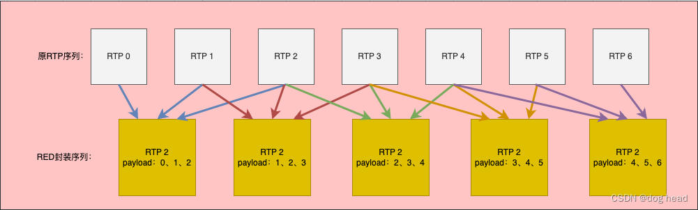

# 一、AudioRed介绍
  Red封装格式前面的文章提到了很多次，本文介绍了我的一个引入的方法，并且把AudioRed在音频抗弱网中进行了测试。下面先简单介绍一下Red封装。

## 1.1 AudioRed有什么用？
  之前提到视频的抗丢包弱网方式有两个：NACK、FEC。与视频需要所有丢包都完全补回的机制不同，音频可能在少数丢包的时候不会造成对话理解问题，因此音频的抗弱网可以说天生就比视频好做。当然，这只是针对于比较轻度的弱网而言，在重度弱网环境下我们仍然需要去处理丢包造成的影响。
  在WebRTC前期，视频的FEC和音频的冗余其实是做在一起的，都依赖于Red封装。音频冗余的方式很有种，我们介绍一下最简单的：


每一个RED封装的数据都携带前两数据，意味着所有包都备份了2份。因此在周期性的丢包情况下，不会对整体传输效果造成影响。

# 1.2 协议格式
  在RFC2198草案中明确定义了RED封装的格式如下：
```
// 整体RTP + AudioRed 包头组成
|RTP header| RED header | RED headr | RED encoding data | RED encoding data|


// AudioRed 头
 0                   1                    2                   3
 0 1 2 3 4 5 6 7 8 9 0 1 2 3  4 5 6 7 8 9 0 1 2 3 4 5 6 7 8 9 0 1
+-+-+-+-+-+-+-+-+-+-+-+-+-+-+-+-+-+-+-+-+-+-+-+-+-+-+-+-+-+-+-+-+
|F|   block PT  |  timestamp offset         |   block length    |
+-+-+-+-+-+-+-+-+-+-+-+-+-+-+-+-+-+-+-+-+-+-+-+-+-+-+-+-+-+-+-+-+

// F：1bit，表明后面是否还有其他RED Header数据，1说明后面具有其他RED Header，0说明这是最后一个RED Header.
// block PT：7bits，表明该RED Header对应的冗余编码类型,初步定义默认为102.
// timestamp offset：14bits，时间戳偏移，相当于RTP Header的时间戳偏移。
// block length：10bits，该RED Header对应编码数据块长度

```
# 二、mediasoup引入Red
  对于mediasoup来说，AudioRed的代码没有迁移过来，因此我们去对应的WebRTC把Red封装的部分的代码迁移过来。同时为了顺着mediasoup对音频的处理逻辑，我们将上下行的Nack关闭，并且只使用了透传的方式控制Red。其实mediasoup对音频采取的态度是使用opus自己的带内fec去做抗丢包能力，音频只进行转发，我们可以从几个细节看出来：
  1.RR的丢包率结合上下行最差的进行上报，意味着将SFU服务器当做不存在；
  2.音频不参与GCC，将音频当做裸流；
  3.音频无Nack，抗丢包依靠Opus内部能力。

## 2.1 代码迁移
  将WebRTC对应的代码迁移到mediasoup对应的模块下，同时把所有依赖都迁移过来。
neteq目录下的：
- red_payload_splitter.cc
- red_payload_splitter.h

## 2.2 方案
  调用上述代码中的SplitRed函数。将red包解码为原始数据包+冗余payload。

调用SplitRed函数返回为一个包的list，最后一个包为该包携带的原始数据，每个数据包都会携带多个Red头，每个Red头中携带了数据采样时相对于当前封包时间戳的偏移，根据偏移量与采样率我们可以计算出相对于当前rtp头的序号大小。例如：
```
// 采样率：48000
// Red内部携带：3个payload
// Rtp包头序号： 4
// Rtp包头时间戳：3840

// 第一个包序号 时间戳偏移量：1920 ——> 序号偏移 (3840 - 1920)/960 = 2
// 第一个包序号为 4 - 2 = 2。

// 依次类推，偏移量为：2880 ——> 序号为：4 -  (3840 - 1920)/960 = 3

```

## 2.3 转发模块
  为了保证在最后一个环节进行Red解封装，我们设计一个新的Consumer类——AudioRedConsumer，这样我们可以通过这个将推Red格式的所有数据都解封装成无Red格式，用来支持旧版兼容。其余我们Red可以透传的可以什么都不用管，从SimpleConsumer直接转发出去。

## 2.4 代码
  拷贝SimpleConsumer的代码进行修改，新增一个解封装成员：webrtc::RedPayloadSplitter，并新增几个辅助函数：
```c++
void SendDecodedRtpPacket(RTC::RtpPacket* packet);
void DecodeRedPacket(RTC::RtpPacket* packet);
bool IsRed(RTC::RtpPacket* packet);
std::vector<RTC::RtpPacket::GenericExtension> GetRedPacketExtension(RTC::RtpPacket* packet);

```
 具体头文件展示为：
```c++
// include/RTC/AudioRedConsumer.hpp

#ifndef MS_RTC_AUDIORED_CONSUMER_HPP
#define MS_RTC_AUDIORED_CONSUMER_HPP

#include "libwebrtc/modules/audio_coding/neteq/red_payload_splitter.h"

#include "RTC/Consumer.hpp"
#include "RTC/RtpStreamSend.hpp"
#include "RTC/SeqManager.hpp"
#include "DepLibUV.hpp"

namespace RTC
{
	class AudioRedConsumer : public RTC::Consumer, public RTC::RtpStreamSend::Listener
	{
	public:
		AudioRedConsumer(
		  const std::string& id,
		  const std::string& producerId,
		  RTC::Consumer::Listener* listener,
		  json& data);
		~AudioRedConsumer() override;

	public:
		void FillJson(json& jsonObject) const override;
		void FillJsonStats(json& jsonArray) const override;
		void FillJsonScore(json& jsonObject) const override;
		void HandleRequest(Channel::Request* request) override;
		bool IsActive() const override
		{
			// clang-format off
			// return (
			// 	RTC::Consumer::IsActive() &&
			// 	this->producerRtpStream &&
			// 	this->producerRtpStream->GetScore() > 0u
			// );
			return (
				RTC::Consumer::IsActive() && this->producerRtpStream
			);
			// clang-format on
		}
		void ProducerRtpStream(RTC::RtpStream* rtpStream, uint32_t mappedSsrc) override;
		void ProducerNewRtpStream(RTC::RtpStream* rtpStream, uint32_t mappedSsrc) override;
		void ProducerRtpStreamScore(RTC::RtpStream* rtpStream, uint8_t score, uint8_t previousScore) override;
		void ProducerRtcpSenderReport(RTC::RtpStream* rtpStream, bool first) override;
		void ProducerRtcpKeepalive() override;
		uint8_t GetBitratePriority() const override;
		uint32_t IncreaseLayer(uint32_t bitrate, bool considerLoss, bool limitT0Send) override;
		void ApplyLayers() override;
		uint32_t GetDesiredBitrate() const override;
		void SendRtpPacket(RTC::RtpPacket* packet) override;
		std::vector<RTC::RtpStreamSend*> GetRtpStreams() override
		{
			return this->rtpStreams;
		}
		void GetRtcp(RTC::RTCP::CompoundPacket* packet, RTC::RtpStreamSend* rtpStream, uint64_t nowMs) override;
		void NeedWorstRemoteFractionLost(uint32_t mappedSsrc, uint8_t& worstRemoteFractionLost) override;
		void ReceiveNack(RTC::RTCP::FeedbackRtpNackPacket* nackPacket) override;
		void ReceiveKeyFrameRequest(RTC::RTCP::FeedbackPs::MessageType messageType, uint32_t ssrc) override;
		void ReceiveRtcpReceiverReport(RTC::RTCP::ReceiverReport* report) override;
		void ReceiveRtcpExtendedReport(RTC::RTCP::ExtendedReportBlock* report, uint64_t nowMs) override;
		uint32_t GetTransmissionRate(uint64_t nowMs) override;
		float GetRtt() const override;

	private:
		// red decode
		void SendDecodedRtpPacket(RTC::RtpPacket* packet);
		void DecodeRedPacket(RTC::RtpPacket* packet);
		bool IsRed(RTC::RtpPacket* packet);
		std::vector<RTC::RtpPacket::GenericExtension> GetRedPacketExtension(RTC::RtpPacket* packet);
		// red decode
		
		void UserOnTransportConnected() override;
		void UserOnTransportDisconnected() override;
		void UserOnPaused() override;
		void UserOnResumed() override;
		void CreateRtpStream();
		void RequestKeyFrame();
		void EmitScore() const;

		/* Pure virtual methods inherited from RtpStreamSend::Listener. */
	public:
		void OnRtpStreamScore(RTC::RtpStream* rtpStream, uint8_t score, uint8_t previousScore) override;
		void OnRtpStreamRetransmitRtpPacket(RTC::RtpStreamSend* rtpStream, RTC::RtpPacket* packet) override;

	private:
		// red decoder
		std::unique_ptr<webrtc::RedPayloadSplitter> redPayloadSplitter;

		// Allocated by this.
		RTC::RtpStreamSend* rtpStream{ nullptr };
		// Others.
		std::vector<RTC::RtpStreamSend*> rtpStreams;
		RTC::RtpStream* producerRtpStream{ nullptr };
		bool keyFrameSupported{ false };
		bool syncRequired{ false };
		RTC::SeqManager<uint16_t> rtpSeqManager;
		bool managingBitrate{ false };
	};
} // namespace RTC

#endif

```
cpp简略代码：
```c++
#define MS_CLASS "RTC::AudioRedConsumer"
 #define MS_LOG_DEV_LEVEL 3

#include "RTC/AudioRedConsumer.hpp"
#include "DepLibUV.hpp"
#include "Logger.hpp"
#include "MpErrors.hpp"
#include "Channel/Notifier.hpp"
#include "RTC/Codecs/Tools.hpp"
#include "RTC/RTCP/Packet.hpp"
#include "common.hpp"
#include "RTC/RTCP/Bye.hpp"

#include "libwebrtc/modules/rtp_rtcp/source/rtp_packet_received.h"
#include "libwebrtc/modules/audio_coding/neteq/packet.h"
#include "libwebrtc/modules/rtp_rtcp/source/rtp_header_extensions.h"
#include "libwebrtc/api/rtp_packet_info.h"

#include <iomanip>
#include <sstream>

namespace RTC
{
	/* Instance methods. */

	AudioRedConsumer::AudioRedConsumer(
	  const std::string& id, const std::string& producerId, RTC::Consumer::Listener* listener, json& data)
	  : RTC::Consumer::Consumer(id, producerId, listener, data, RTC::RtpParameters::Type::AUDIORED)
	{
		MS_TRACE();

		// Ensure there is a single encoding.
		if (this->consumableRtpEncodings.size() != 1u)
			MS_THROW_TYPE_ERROR("invalid consumableRtpEncodings with size != 1");

		auto& encoding         = this->rtpParameters.encodings[0];
		const auto* mediaCodec = this->rtpParameters.GetCodecForEncoding(encoding);

		this->keyFrameSupported = RTC::Codecs::Tools::CanBeKeyFrame(mediaCodec->mimeType);

		// Create RtpStreamSend instance for sending a single stream to the remote.
		CreateRtpStream();

		// 创建 red 解码
		this->redPayloadSplitter.reset(new webrtc::RedPayloadSplitter());
	}

 	...


    // 这里将原先的函数修改为我们自己的解包函数
	void AudioRedConsumer::SendRtpPacket(RTC::RtpPacket* packet)
	{
		MS_TRACE();

		this->DecodeRedPacket(packet);
	}

	bool AudioRedConsumer::IsRed(RTC::RtpPacket* packet)
	{
		return packet->GetPayloadType() == 102 ? true : false;
	}

	void AudioRedConsumer::DecodeRedPacket(RTC::RtpPacket* packet)
	{
		MS_TRACE();
		
//		if (!IsRed(packet))
//			return;

		MS_WARN_TAG(rtp, "red consumer receive a rtp packet, consumerId: %s", this->id.c_str());

		webrtc::RtpPacketReceived parsed_packet(nullptr);
		if (!parsed_packet.Parse(packet->GetData(), packet->GetSize()))
		{
			MS_WARN_TAG(rtp, "receive red packet but parses packet failed!");
			return;
		}

		webrtc::RTPHeader rtp_header;
		parsed_packet.GetHeader(&rtp_header);
		auto payload = parsed_packet.payload();

		int64_t receive_time_ms = DepLibUV::GetTimeMs();
		webrtc::PacketList packet_list;
		// Insert packet in a packet list.
		packet_list.push_back([&rtp_header, &payload, &receive_time_ms] {
			// Convert to Packet.
			webrtc::Packet packet;
			packet.payload_type = rtp_header.payloadType;
			packet.sequence_number = rtp_header.sequenceNumber;
			packet.timestamp = rtp_header.timestamp;
			packet.payload.SetData(payload.data(), payload.size());
			packet.packet_info = webrtc::RtpPacketInfo(rtp_header, receive_time_ms);
			// Waiting time will be set upon inserting the packet in the buffer.
			return packet;
		}());

		if (!redPayloadSplitter->SplitRed(&packet_list)) {
			MS_WARN_TAG(rtp, "split red packet failed!");
			return;
		}
		if (packet_list.empty()) {
			MS_WARN_TAG(rtp, "red packet list is empty!");
			return;
		}
		// 获取拓展头内容
		auto extensions = this->GetRedPacketExtension(packet);
		auto it = packet_list.begin();
		while (it != packet_list.end()) {

			webrtc::RtpPacketReceived recover_packet;
			auto recover_seq = (*it).sequence_number - ((rtp_header.timestamp - (*it).timestamp)/960);
			recover_packet.SetSequenceNumber(recover_seq);
			recover_packet.SetPayloadType((*it).payload_type);
			recover_packet.SetTimestamp((*it).timestamp);
			recover_packet.SetMarker(rtp_header.markerBit);
			recover_packet.SetSsrc(rtp_header.ssrc);

			uint8_t* payload = recover_packet.AllocatePayload((*it).payload.size());
			if (!payload)  // Too large payload buffer.
			{
				MS_WARN_TAG(rtp, "red recover packet Too large payload buffer");
				return;
			}
			memcpy(payload, (*it).payload.data(), (*it).payload.size());

			RTC::RtpPacket* recover_packet2 = RTC::RtpPacket::Parse(recover_packet.data(), recover_packet.size());
			if (!recover_packet2){
				MS_WARN_TAG(rtp, "red recover packet data is not a valid RTP packet");
				return;
			}

			// 设置拓展mid
			recover_packet2->SetExtensions(2, extensions);
			recover_packet2->SetMidExtensionId(static_cast<uint8_t>(RTC::RtpHeaderExtensionUri::Type::MID));
			const auto& mid = this->GetRtpParameters().mid;
			if (!mid.empty())
				recover_packet2->UpdateMid(mid);

			this->SendDecodedRtpPacket(recover_packet2);

			it++;
		}
	}

	// 该函数与router中需要对齐
	std::vector<RTC::RtpPacket::GenericExtension> AudioRedConsumer::GetRedPacketExtension(RTC::RtpPacket* packet) {

		uint8_t buffer[4096];
		std::vector<RTC::RtpPacket::GenericExtension> extensions;

		// This happens just once.
		if (extensions.capacity() != 24)
			extensions.reserve(24);

		extensions.clear();

		uint8_t* extenValue;
		uint8_t extenLen;
		uint8_t* bufferPtr{ buffer };

		{
			extenLen = RTC::MidMaxLength;

			extensions.emplace_back(
				static_cast<uint8_t>(RTC::RtpHeaderExtensionUri::Type::MID), extenLen, bufferPtr);

			bufferPtr += extenLen;
		}

		{
			// Proxy urn:ietf:params:rtp-hdrext:ssrc-audio-level.
			extenValue = packet->GetExtension(this->rtpHeaderExtensionIds.ssrcAudioLevel, extenLen);
			if (extenValue)
			{
				std::memcpy(bufferPtr, extenValue, extenLen);

				extensions.emplace_back(
					static_cast<uint8_t>(RTC::RtpHeaderExtensionUri::Type::SSRC_AUDIO_LEVEL),
					extenLen,
					bufferPtr);

				// Not needed since this is the latest added extension.
				// bufferPtr += extenLen;
			}
		}

		{					
			extenValue = packet->GetExtension(this->rtpHeaderExtensionIds.absCaptureTime, extenLen);

			if (extenValue)
			{
				std::memcpy(bufferPtr, extenValue, extenLen);

				extensions.emplace_back(
				static_cast<uint8_t>(RTC::RtpHeaderExtensionUri::Type::ABS_CAPTURE_TIME),
				extenLen,
				bufferPtr);

				bufferPtr += extenLen;
			}
		}

		return extensions;
	}

	void AudioRedConsumer::SendDecodedRtpPacket(RTC::RtpPacket* packet) {
		MS_TRACE();

		if (!IsActive())
			return;

		auto payloadType = packet->GetPayloadType();

		// NOTE: This may happen if this Consumer supports just some codecs of those
		// in the corresponding Producer.
		if (this->supportedCodecPayloadTypes.find(payloadType) == this->supportedCodecPayloadTypes.end())
		{
			MS_DEBUG_DEV("payload type not supported [payloadType:%" PRIu8 "]", payloadType);

			return;
		}

		// If we need to sync, support key frames and this is not a key frame, ignore
		// the packet.
		if (this->syncRequired && this->keyFrameSupported && !packet->IsKeyFrame())
			return;

		// Whether this is the first packet after re-sync.
		bool isSyncPacket = this->syncRequired;

		// Sync sequence number and timestamp if required.
		if (isSyncPacket)
		{
			if (packet->IsKeyFrame())
				MS_DEBUG_TAG(rtp, "sync key frame received");

			this->rtpSeqManager.Sync(packet->GetSequenceNumber() - 1);

			this->syncRequired = false;
		}

		// Update RTP seq number and timestamp.
		uint16_t seq;

		this->rtpSeqManager.Input(packet->GetSequenceNumber(), seq);

		// Save original packet fields.
		auto origSsrc = packet->GetSsrc();
		auto origSeq  = packet->GetSequenceNumber();

		// Rewrite packet.
		packet->SetSsrc(this->rtpParameters.encodings[0].ssrc);
		packet->SetSequenceNumber(seq);

		if (isSyncPacket)
		{
			MS_DEBUG_TAG(
			  rtp,
			  "sending sync packet [ssrc:%" PRIu32 ", seq:%" PRIu16 ", ts:%" PRIu32
			  "] from original [seq:%" PRIu16 "]",
			  packet->GetSsrc(),
			  packet->GetSequenceNumber(),
			  packet->GetTimestamp(),
			  origSeq);
		}

		MS_WARN_TAG(rtp, "red consumer send a rtp packet, consumer Id: %s", this->id.c_str());

		// Process the packet.
		if (this->rtpStream->ReceivePacket(packet))
		{
			// Send the packet.
			this->listener->OnConsumerSendRtpPacket(this, packet);

			// May emit 'trace' event.
			//EmitTraceEventRtpAndKeyFrameTypes(packet);
			MS_DEBUG_TAG(rtp,
			"consumer keyframe packet [ssrc:%" PRIu32 ", seq:%" PRIu16 ", ts:%" PRIu32
			 "] from original [seq:%" PRIu16 "]",
			  packet->GetSsrc(),
			  packet->GetSequenceNumber(),
			  packet->GetTimestamp(),
			  origSeq);
		}
		else
		{
			MS_WARN_TAG(
			  rtp,
			  "failed to send packet [ssrc:%" PRIu32 ", seq:%" PRIu16 ", ts:%" PRIu32
			  "] from original [seq:%" PRIu16 "]",
			  packet->GetSsrc(),
			  packet->GetSequenceNumber(),
			  packet->GetTimestamp(),
			  origSeq);
		}

		// Restore packet fields.
		packet->SetSsrc(origSsrc);
		packet->SetSequenceNumber(origSeq);
	}

} // namespace RTC

```

# 三、总结
## 3.1 效果
  在进行Red测试之前，我们验证了无Nack和无Red冗余的表现。在50%丢包情况下，整体语音传输基本已经无法理解，同时丢包严重。

上行弱网测试结果：
  1.在纯50%丢包的环境下，音频理解无异常；
  2.在50%丢包 + 100ms的弱网环境下，音频理解无异常，整体效果比Nack优秀；

码率增长：从60kbps增长至120kbps左右。

## 3.2 小结
  本文简单介绍了mediasoup引入Red一个透传方案，做了简单的测试。mediasoup在质量方面存在比较多缺陷，我们仍然需要不断地丰富来实现提高。对于FEC和Red，作者IBC明确说了不会支持，希望我的方案可以给大家一些启发。