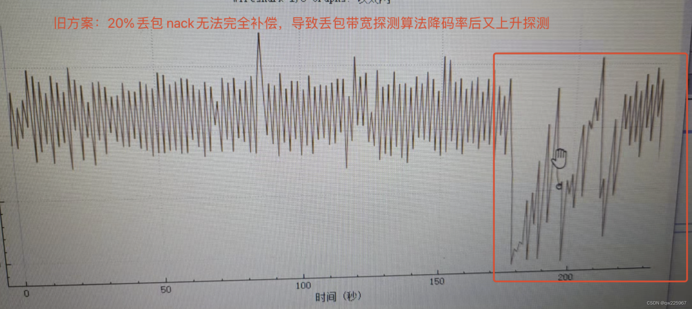
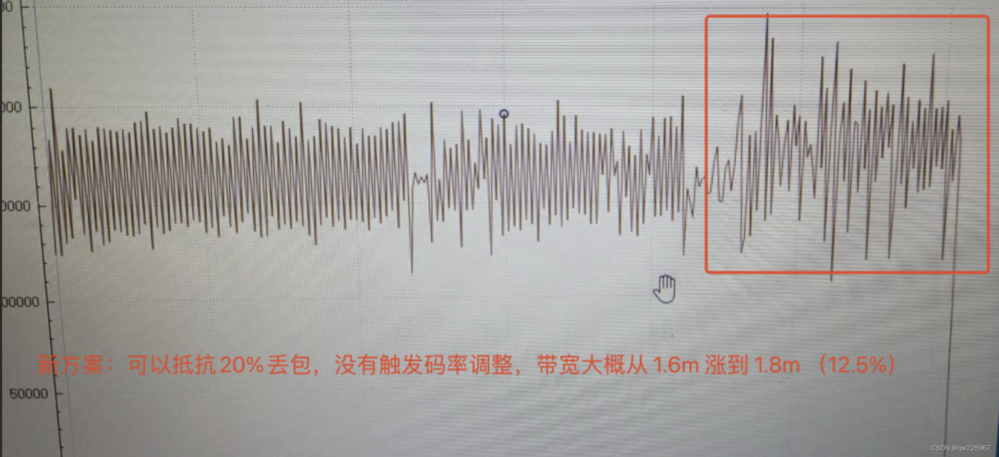
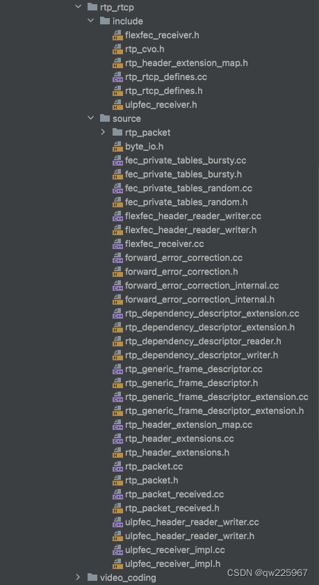
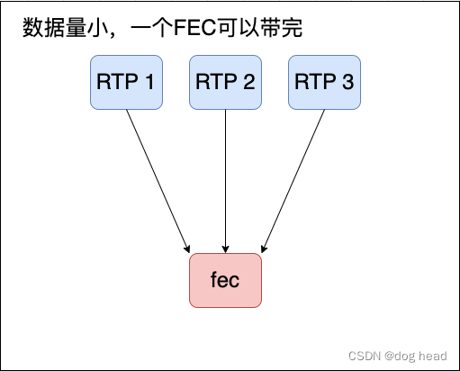
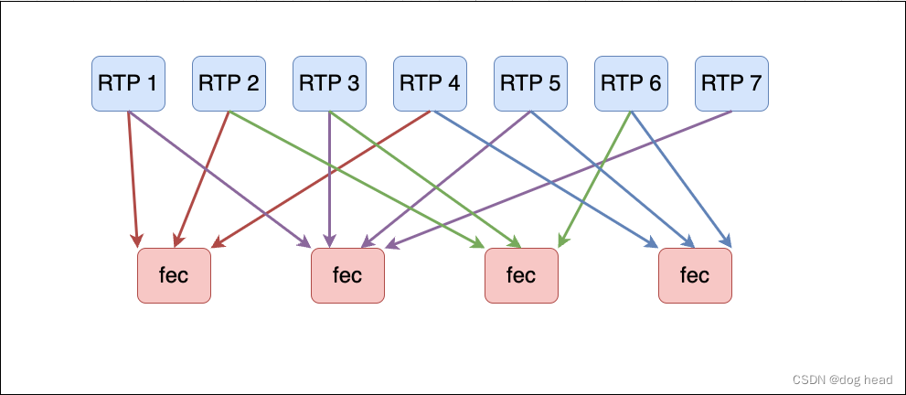
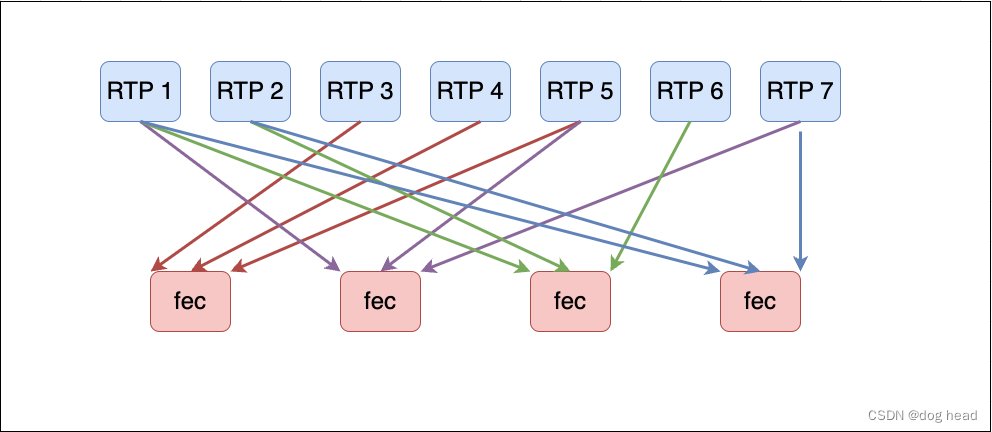

流媒体弱网优化之路(FEC+mediasoup)
# 一、mediasoup上行情况
  最近对mediasoup进行了一部分的上行弱网优化工作，在这里对之前的优化工作做一些总结和分析。按照惯例，在开始讲关键内容前先把mediasoup上行数据传输以及控制手段进行简单的介绍。

发送端中完整地使用了webrtc中的tcc带宽估计以及Nack模块。当数据包传输时，可以识别网络的带宽突变，同时也具备一定的丢包重传能力。

# 二、纯Nack优化的效果
## 2.1 方案
  事实上，这远远达不到我们生产开发中的要求。在实际的测试中，我们拉流的播放端在不扩大缓存（增大延迟）、慢放的情况下，10%的丢包就已经出现比较明显的卡顿情况。这类卡顿造成的原因主要来自于下行数据包的延迟到达或者丢失。因此，我们前段时间做的Nack优化提出了——在保证数据包完整到达的同时还要保证足够快地补偿给对端 弱网优化之路(NACK)——纯NACK方案的优化探索。
  根据我们的Nack优化思路，我们把 RTC/NackGenerator.cpp 部分函数的代码修改成了这样：
```c
  /* Static. */

  constexpr size_t MaxPacketAge{ 10000u };
  constexpr size_t MaxNackPackets{ 1000u };
  constexpr uint32_t DefaultRtt{ 100u };
  // constexpr uint8_t MaxNackRetries{ 10u };
  // constexpr uint64_t TimerInterval{ 40u };

  // =================== nack test ===================
  constexpr uint8_t MaxNackRetries{ 20u };
  constexpr uint64_t TimerInterval{ 20u };
  // =================== nack test ===================  

...

  // =================== nack test ===================
  double NackGenerator::CalculateRttLimit2SendNack(int tryTimes) {
    return tryTimes < 3 ?  (double)(tryTimes*0.4) + 1 : 2;
  }
  // =================== nack test ===================
  std::vector<uint16_t> NackGenerator::GetNackBatch(NackFilter filter)
  {
    MS_TRACE();

    uint64_t nowMs = DepLibUV::GetTimeMs();
    std::vector<uint16_t> nackBatch;

    auto it = this->nackList.begin();
    while (it != this->nackList.end())
    {
      NackInfo& nackInfo = it->second;
      uint16_t seq       = nackInfo.seq;
      if (filter == NackFilter::SEQ &&
          nackInfo.sentAtMs == 0 &&
          (
              nackInfo.sendAtSeq == this->lastSeq ||
              SeqManager<uint16_t>::IsSeqHigherThan(this->lastSeq, nackInfo.sendAtSeq)
          )
        )
        {
          nackBatch.emplace_back(seq);
          nackInfo.retries++;
          auto oldMs = nackInfo.sentAtMs;
          nackInfo.sentAtMs = nowMs;

          if (oldMs == 0) {
            oldMs = nowMs;
          }

          if (nackInfo.retries >= MaxNackRetries)
          {
            MS_WARN_TAG(rtx,
              "sequence number removed from the NACK list due to max retries [filter:seq, seq:%" PRIu16 "]",
              seq);

            it = this->nackList.erase(it);
          } else {
          ++it;
          }

          continue;
        }

      // =================== nack test ===================
      auto limit_var = uint64_t(this->rtt/CalculateRttLimit2SendNack(nackInfo.retries));

      // =================== nack test ===================
      // if (filter == NackFilter::TIME && nowMs - nackInfo.sentAtMs >= this->rtt)
      if (filter == NackFilter::TIME && nowMs - nackInfo.sentAtMs >= limit_var)
      {
        nackBatch.emplace_back(seq);
        nackInfo.retries++;

        auto oldMs = nackInfo.sentAtMs;
        nackInfo.sentAtMs = nowMs;

        if (oldMs == 0) {
          oldMs = nowMs;
        }

        if (nackInfo.retries >= MaxNackRetries)
        {
          MS_WARN_TAG(rtx,
              "sequence number removed from the NACK list due to max retries [filter:time, seq:%" PRIu16 "]", seq);

          it = this->nackList.erase(it);
        }
        else
        {
          ++it;
        }

        continue;
      }

      ++it;
    }

...

```

也就是：
1. 将定时器间隔从 40ms/次 下调到 20ms/次；
2. 将最大重传次数从 10次 上调至 20次（还可以增大到40次）；
3. 最后是根据 rtt 我们重传次数越多的包要的越频繁。

## 2.2 结果
整体测试方案：
1. 同一局域网中的两台安卓进行推拉流测试；
2. 弱网限制由 Windows 机器中的 Network Emulator Client 软件进行模拟；
3. 将拉流画面按 15 帧切割后逐帧对比变化程度（使用OpenCV编写的对比demo）；
4. 两张图片相同则认为发生130ms的卡顿（15帧每秒——每帧 66.6ms ），后续依次类推计算出卡顿率（具体对比的demo和方法可以参考我的 github）；
5. 得出结论包括：
    - 客观（卡顿率变化、卡顿时长占比、卡顿次数占比、带宽变化）；
    - 主观（观看感受、画面质感）。

### 客观结果展示：
  卡顿率统计： 20%丢包+100ms延迟场景

20%丢包场景   | 旧方案  | 新方案 | 结果
----  | ----  | --- | ---
整体卡顿率   | 41.69% | 28.44% | -13.25%
最长卡顿时间 |  1s | 900ms | -100ms
120ms卡顿次数 | 87 | 78 | -9
240ms卡顿次数 | 52 | 38 | -14
360ms卡顿次数 | 18 | 13 | -5
480ms卡顿次数 | 1 | 7 | +6 由500ms以上卡顿降下来的
500ms卡顿次数 | 18 | 13 | -5

wireshark抓包信息显示：

    旧方案：无法抵抗20%丢包，没有全补上包导致丢包带宽估计算法降码率又重新上升探测的过程，影响观看体验。


新方案：可以抵抗20%丢包，完全补上包没有触发丢包带宽估计，同时nack导致码率上升，从1.6m ~ 1.8m左右（12.5%）


由上面的内容变化来看，实测卡顿率有效降低13.25%（取多次测试中间值）。同时，nack补偿会带来12.5%的带宽上涨。

### 主观体验：
  事实上，整体画面的质感变化不大，但是Nack新方案缩短了重传间隔，因此中间画面跳跃时长更短。以上介绍的内容只是纯nack方案优化带来的，但实际上10%丢包的环境也无法做到无感知抵抗（在不增加延迟弱网的情况，如果加上延迟卡顿会更严重）。如果需要继续缩短补包间隔来达到降低卡顿率的目的，需要考虑增加FEC。

# 三、mediasoup中引入FEC
## 3.1 FEC方案
  目前WebRTC的FEC方案有两个——UlpFEC、FlexFEC。
- UlpFEC方案：
  UlpFEC在WebRTC中使用了RED进行封装（客户端使用原生的WebRTC打开，UlpFEC必须使用RED封装），具体的就不展开讨论了，而FlexFEC是可以单独进行封装的。这两种方式的实现难度会有所区别。

UlpFEC中，FEC包会和普通的RTP包进行统一打包，也就意味着数据包的序列号是一起统计的。例如，现在有三个视频包和一个FEC包，那么这三个视频包的序列号和FEC包的序列号会合在一起——1（RTP）——2（RTP）——3（FEC）——4（RTP）。很显然，这样会影响我们mediasoup中的Nack队列的统计（因为我们的Nack队列是序号相减计算出来的）。

而且mediasoup本身就不支持RED，那么实现起来我们还需要调整很多的东西，因此传统的UlpFEC的实现方式暂时不考虑。

- FlexFEC方案：
  FlexFEC其实底层的算法支持也还是在使用UlpFEC封装的，在这我们只是把他新的实现方式与旧的做一个区分，因此称为FlexFEC。

### 客户端
  我们使用FlexFEC则比UlpFEC要方便的多。因为在上层不强制使用RED封装，而是提供了一个开关，例如客户端以下代码展示：
```c
fieldtrials=”WebRTC-FlexFEC-03/Enabled/WebRTC-FlexFEC-03-Advertised/Enabled”

// 1.假设你的sdk在call上层进行封装的
//   那么你只能使用call中提供的设置流codec的接口，将flexfec的保护ssrc设置进去，例如：

...

  cricket::StreamParams stream;
  stream.ssrcs.push_back(ssrc);
  stream.ssrcs.push_back(ssrc);
  // 设置flexfec的保护ssrc和自己的ssrc，可以设置成一样。
  stream.AddFecFrSsrc(ssrc, ssrc); 

...

  VideoChannel->->media_channel()->AddSendStream(stream);

...


// 2.假设你的sdk在call下层进行封装的
//   那么你只需要在创建 VideoSendStream 时将flexfec一起设置进去即可，例如：

...

  config.suspend_below_min_bitrate = video_config_.suspend_below_min_bitrate;
  config.periodic_alr_bandwidth_probing =
      video_config_.periodic_alr_bandwidth_probing;
  config.encoder_settings.experiment_cpu_load_estimator =
      video_config_.experiment_cpu_load_estimator;
  config.encoder_settings.encoder_factory = encoder_factory_;
  config.encoder_settings.bitrate_allocator_factory =
      bitrate_allocator_factory_;
  config.encoder_settings.encoder_switch_request_callback = this;
  config.crypto_options = crypto_options_;
  config.rtp.extmap_allow_mixed = ExtmapAllowMixed();
  config.rtcp_report_interval_ms = video_config_.rtcp_report_interval_ms;
  
  std::vector<uint32_t> protected_ssrcs;
  protected_ssrcs.push_back(sp.ssrcs[0]);
  config.rtp.flexfec.ssrc = ssrc;
  config.rtp.flexfec.protected_media_ssrcs = protected_ssrcs;
  
...

```
### 服务端
  服务端部分需要添加FEC解码模块，并且应该在NACK模块之前，这样可以减少不必要的重传。
mediasoup的WebRTC代码还是m77版本的，因此我们将m77的fec解码部分全部迁移到mediasoup的目录中。


随后在 RtpStreamRecv 接收rtp包的部分进行解码，解出来的数据上抛回producer。
```c++
// RTC/RtpStreamRecv.hpp
// 接收流部分添加flexfec解码对象，同时仿照 ReceivePacket 函数新增一个 FecReceivePacket 函数。
  class RtpStreamRecv : public RTC::RtpStream,
                        public RTC::NackGenerator::Listener,
                        public Timer::Listener
  {
	...
	
    /* ---------- flexfec ---------- */
    bool FecReceivePacket(RTC::RtpPacket* packet, bool isRecover);
    bool IsFlexFecPacket(RTC::RtpPacket* packet);

    std::unique_ptr<webrtc::FlexfecReceiver> flexfecReceiver;
    /* ---------- flexfec ---------- */
    
	...
 }
	
/* -------------------------------- 分割线 -------------------------------- */

// RTC/RtpStreamRecv.cpp
/* ---------- flexfec ---------- */
  bool RtpStreamRecv::IsFlexFecPacket(RTC::RtpPacket *packet) {
    if (packet == nullptr) return false;
    return packet->GetPayloadType() == params.fecPayloadType ? true : false;
  }

  bool RtpStreamRecv::FecReceivePacket(RTC::RtpPacket *packet, bool isRecover) {
    if (this->params.useFec) {
      MS_WARN_TAG(rtp,
        "fec packet receive [ssrc:%" PRIu32 ", payloadType:%" PRIu8 ", seq:%" PRIu16,
        packet->GetSsrc(),
        packet->GetPayloadType(),
        packet->GetSequenceNumber());
      // 所有数据都入 fec 解码模块
      if (flexfecReceiver) {
        webrtc::RtpPacketReceived parsed_packet(nullptr);
        if (!parsed_packet.Parse(packet->GetData(), packet->GetSize())) {
          MS_WARN_TAG(rtp, "receive fec packet but parsed_packet failed!");
          return false;
        }
        // 如果是恢复包打上恢复记号
        parsed_packet.set_recovered(isRecover);

        flexfecReceiver->OnRtpPacket(parsed_packet);
      }
      else {
        MS_WARN_TAG(rtp, "receive fec packet but receiver is not exit");
        // do not things
      }
    }

    if (isRecover)
      this->AddFecRepaired();

    // fec包跳过后续流程
    if (IsFlexFecPacket(packet)) {
      packetFecCount++;
      return false;
    }
    return true;
  }
	/* ---------- flexfec ---------- */
};

```
在producer部分，我们需要继承flexfec的回调类，来承接恢复的数据。
```c++
// RTC/Producer.hpp
class Producer : public RTC::RtpStreamRecv::Listener,
	                 public RTC::KeyFrameRequestManager::Listener,
	                 public Timer::Listener,
	                 public webrtc::RecoveredPacketReceiver
{

...
	// 新增传入参数 isRecover
	ReceiveRtpPacketResult ReceiveRtpPacket(RTC::RtpPacket* packet, bool isRecover);
	
	private:
		/* ---------- flexfec ---------- */
		void OnRecoveredPacket(const uint8_t *packet, size_t length) override;
		/* ---------- flexfec ---------- */
...
}

/* -------------------------------- 分割线 -------------------------------- */
// RTC/Producer.cpp
Producer::ReceiveRtpPacketResult Producer::ReceiveRtpPacket(RTC::RtpPacket* packet, bool isRecover) {
  ...
  // Media packet.
  if (packet->GetSsrc() == rtpStream->GetSsrc()) {
    result = ReceiveRtpPacketResult::MEDIA;

    // FEC 或 media 都包进入模块进行处理
    if(!rtpStream->FecReceivePacket(packet, isRecover)) {
      return result;
    }
    if (!isRecover) {
      // Process the packet.
      if (!rtpStream->ReceivePacket(packet))
      {
        // May have to announce a new RTP stream to the listener.
        if (this->mapSsrcRtpStream.size() > numRtpStreamsBefore)
          NotifyNewRtpStream(rtpStream);

        return result;
      }
    }
  }
  ...
}

...

/* ---------- flexfec ---------- */
void Producer::OnRecoveredPacket(const uint8_t* packet, size_t length) {
  RTC::RtpPacket* recover_packet = RTC::RtpPacket::Parse(packet, length);
  if (!recover_packet){
    MS_WARN_TAG(rtp, "fec recover packet data is not a valid RTP packet");
    return;
  }

  this->ReceiveRtpPacket(recover_packet, true);

  MS_WARN_TAG(rtp,
      "fec packet recover [ssrc:%" PRIu32 ", payloadType:%" PRIu8 ", seq:%" PRIu16,
      recover_packet->GetSsrc(),
      recover_packet->GetPayloadType(),
      recover_packet->GetSequenceNumber());
}
	/* ---------- flexfec ---------- */


```
在Transport中还需要添加调用Producer的接收函数时传入isRecover值为true。
```c
// RTC/Transport.cpp
void Transport::ReceiveRtpPacket(RTC::RtpPacket* packet) {
  ...
  // Pass the RTP packet to the corresponding Producer.
  auto result = producer->ReceiveRtpPacket(packet, false);
  ...
}
```
## 3.2 结果讨论
  按照上述的方式完成后，我们进行了丢包+100ms延迟的测试。

丢包率 | FEC+NACK | NACK | 对比
--- | --- | --- | --
20% | 4.8%(最大卡顿240ms) | 32.4%(最大卡顿420ms) | -27.6
30% | 18.2%(最大卡顿420ms) | 35.9%(最大卡顿550ms) | -17.7
40% | 22.7%(最大卡顿420ms) | 41.1%(最大卡顿2s) | -18.4
50% | 33.6%(最大卡顿960ms) | 57.6%(最大卡顿500ms) | -24

  可见整体的卡顿率都有大幅的下降。

  最重要的是，在10%丢包的场景下，已经基本实现了无感知的优化（接收端不做快慢放，不增加jitter）。


# 四、相关知识
## ulpfec封包格式
  我们知道FEC在webrtc中的实现有两种，一个是基于通一条流red封装的ulpfec、一个是独立流flexfec。在我集成flexfec时，底层还是用的ulpfec的算法，因此我一并进行简单介绍（具体的代码就不说了，后面集中说代码）。
  直接看一下red封装的格式：
```
 0                   1                    2                   3
 0 1 2 3 4 5 6 7 8 9 0 1 2 3 4 5 6 7 8 9 0 1 2 3 4 5 6 7 8 9 0 1
+-+-+-+-+-+-+-+-+-+-+-+-+-+-+-+-+-+-+-+-+-+-+-+-+-+-+-+-+-+-+-+-+
|F|   block PT  |  timestamp offset         |   block length    | : block header
+-+-+-+-+-+-+-+-+-+-+-+-+-+-+-+-+-+-+-+-+-+-+-+-+-+-+-+-+-+-+-+-+
|                             block                             | : data block
+-+-+-+-+-+-+-+-+-+-+-+-+-+-+-+-+-+-+-+-+-+-+-+-+-+-+-+-+-+-+-+-+
```
它是在rtp头之下的，由 block header 和 block data 两部分组成。很好理解，把它和rtp头画一起就是这样：
```
 0                   1                    2                   3
 0 1 2 3 4 5 6 7 8 9 0 1 2 3 4 5 6 7 8 9 0 1 2 3 4 5 6 7 8 9 0 1
+-+-+-+-+-+-+-+-+-+-+-+-+-+-+-+-+-+-+-+-+-+-+-+-+-+-+-+-+-+-+-+-+
|V=2|P|X| CC=0  |M|      PT     |   sequence number of primary  |
+-+-+-+-+-+-+-+-+-+-+-+-+-+-+-+-+-+-+-+-+-+-+-+-+-+-+-+-+-+-+-+-+
|              timestamp  of primary encoding                   |
+-+-+-+-+-+-+-+-+-+-+-+-+-+-+-+-+-+-+-+-+-+-+-+-+-+-+-+-+-+-+-+-+
|           synchronization source (SSRC) identifier            |
+-+-+-+-+-+-+-+-+-+-+-+-+-+-+-+-+-+-+-+-+-+-+-+-+-+-+-+-+-+-+-+-+
|1| block PT=7  |  timestamp offset         |   block length    |
+-+-+-+-+-+-+-+-+-+-+-+-+-+-+-+-+-+-+-+-+-+-+-+-+-+-+-+-+-+-+-+-+
|0| block PT=5  |                                               |
+-+-+-+-+-+-+-+-+                                               +
|                                                               |
+                LPC encoded redundant data (PT=7)              +
|                (14 bytes)                                     |
+                                               +---------------+
|                                               |               |
+-+-+-+-+-+-+-+-+-+-+-+-+-+-+-+-+-+-+-+-+-+-+-+-+               +
|                                                               |
+                                                               +
+                                                               +
|                DVI4 encoded primary data (PT=5)               |
+                (44 bytes, not to scale)                       +
/                                                               /
+                                                               +
|                                                               |
+                                               +---------------+
|                                               |

```
我们来看看它 block header 里的字段的意义：
- F：标识是否存在多个red封装的标志：
  1. 为1时标识后面是否有别的block,如果有则会出现多个同样的header；
  2. 为0时，标识后面不会再有这个header line，同时最后block的timestamp和block length能够通过rtp推断出，所以会省略。
- block PT： block内容中的rtp payload type（也就是包原始的数据pt）；
- block length： block的大小；
- timestamp offset： block timestamp 相对于rtp header timestamp 的偏移量，如：red冗余的包序号是3，而rtp包的序号是5，那么3恢复出来的包头就需要通过该字段去计算。

##  flexfec封包格式
  而对于flexfec除了有单独的一条流标识之外，还有seq也是独立的，同时整个协议的格式也进行了重新设计。在rfc8627中定义的flexfec的格式如下：

```
 0                   1                   2                   3
 0 1 2 3 4 5 6 7 8 9 0 1 2 3 4 5 6 7 8 9 0 1 2 3 4 5 6 7 8 9 0 1
+-+-+-+-+-+-+-+-+-+-+-+-+-+-+-+-+-+-+-+-+-+-+-+-+-+-+-+-+-+-+-+-+
|R|F|P|X|  CC   |M| PT recovery | ...varies depending on R/F... |
+-+-+-+-+-+-+-+-+-+-+-+-+-+-+-+-+-+-+-+-+-+-+-+-+-+-+-+-+-+-+-+-+
|                                                               |
|                 ...varies depending on R/F...                 |
|                                                               |
+-+-+-+-+-+-+-+-+-+-+-+-+-+-+-+-+-+-+-+-+-+-+-+-+-+-+-+-+-+-+-+-+
:                Repair Payload follows FEC header              :
:                                                               :

```

在这里我先解释字段的意思：
  R：这个字段为了标识该包是否是重传包，如果是重传包则必须把R置为1，对于正常的FEC包则必须为0；
  F：表示为FEC包，当 R 位为 1时， F 位必须设置为 0 。如果R 位为 1 还把F置为1，那么这个包不会被处理。
  P、X、CC、M 和 PT 字段用于确定恢复数据包的相应包头字段信息（事实上就是RTP头对应的几个标识的意思），换算过程比较复杂我们简单凝练了一下：

假设在整个数据集T中丢失了一个数据包，我们需要恢复丢失序号包的包头内容，则需进行以下操作：
1. 根据数据集T中其他已接收到数据包的包头前64位，换算出一个80位的字符串；
2. 取出FEC包中前80位作为另一个字符串；
3. 将两个字符串进行异或操作，来得到恢复出来的rtp包头。
4. 根据恢复出来的字符串依次放入到rtp头中：
    - V填入2（恢复字符串依次便宜对应大小）；
    - P为Padding位填入恢复字符串的对应内容；
    - X为Extension位填入恢复字符串的对应内容；
    - CC字段同理；
    - MM字段同理；
    - PT字段同理。
这样，整个丢失的RTP包头就实现了完整恢复了。

上面介绍完了前面几个协议字段的意义，后面就跟着flexfec具体标识内容的部分。flexfec的头有下面四种变体，实现了它所需求的灵活性：
```
+---+---+-----------------------------------------------------+
| R | F | FEC header variant                                  |
+---+---+-----------------------------------------------------+
| 0 | 0 | Flexible FEC Mask fields indicate source packets    |
| 0 | 1 | Fixed FEC L/D (cols/rows) indicate source packets   |
| 1 | 0 | Retransmission of a single source packet            |
| 1 | 1 | Reserved for future use, MUST NOT send, MUST ignore |
+---+---+-----------------------------------------------------+
```
上面说的变体大家可以看看英文的描述，其实对应以下形式（R=1 F=1的形式会被忽略，不展示）：
```
R=0 F=0

 0                   1                   2                   3
 0 1 2 3 4 5 6 7 8 9 0 1 2 3 4 5 6 7 8 9 0 1 2 3 4 5 6 7 8 9 0 1
+-+-+-+-+-+-+-+-+-+-+-+-+-+-+-+-+-+-+-+-+-+-+-+-+-+-+-+-+-+-+-+-+
|0|0|P|X|  CC   |M| PT recovery |        length recovery        |
+-+-+-+-+-+-+-+-+-+-+-+-+-+-+-+-+-+-+-+-+-+-+-+-+-+-+-+-+-+-+-+-+
|                          TS recovery                          |
+-+-+-+-+-+-+-+-+-+-+-+-+-+-+-+-+-+-+-+-+-+-+-+-+-+-+-+-+-+-+-+-+
|           SN base_i           |k|          Mask [0-14]        |
+-+-+-+-+-+-+-+-+-+-+-+-+-+-+-+-+-+-+-+-+-+-+-+-+-+-+-+-+-+-+-+-+
|k|                   Mask [15-45] (optional)                   |
+-+-+-+-+-+-+-+-+-+-+-+-+-+-+-+-+-+-+-+-+-+-+-+-+-+-+-+-+-+-+-+-+
|                     Mask [46-109] (optional)                  |
|                                                               |
+-+-+-+-+-+-+-+-+-+-+-+-+-+-+-+-+-+-+-+-+-+-+-+-+-+-+-+-+-+-+-+-+
|   ... next SN base and Mask for CSRC_i in CSRC list ...       |
+-+-+-+-+-+-+-+-+-+-+-+-+-+-+-+-+-+-+-+-+-+-+-+-+-+-+-+-+-+-+-+-+
:                Repair Payload follows FEC header              :
:                                                               :
```

```
R=0 F=1

 0                   1                   2                   3
 0 1 2 3 4 5 6 7 8 9 0 1 2 3 4 5 6 7 8 9 0 1 2 3 4 5 6 7 8 9 0 1
+-+-+-+-+-+-+-+-+-+-+-+-+-+-+-+-+-+-+-+-+-+-+-+-+-+-+-+-+-+-+-+-+
|0|1|P|X|  CC   |M| PT recovery |         length recovery       |
+-+-+-+-+-+-+-+-+-+-+-+-+-+-+-+-+-+-+-+-+-+-+-+-+-+-+-+-+-+-+-+-+
|                          TS recovery                          |
+-+-+-+-+-+-+-+-+-+-+-+-+-+-+-+-+-+-+-+-+-+-+-+-+-+-+-+-+-+-+-+-+
|           SN base_i           |  L (columns)  |    D (rows)   |
+-+-+-+-+-+-+-+-+-+-+-+-+-+-+-+-+-+-+-+-+-+-+-+-+-+-+-+-+-+-+-+-+
|    ... next SN base and L/D for CSRC_i in CSRC list ...       |
+-+-+-+-+-+-+-+-+-+-+-+-+-+-+-+-+-+-+-+-+-+-+-+-+-+-+-+-+-+-+-+-+
:                Repair Payload follows FEC header              :
:                                                               :
```

```
R=1 F=0
 0                   1                   2                   3
 0 1 2 3 4 5 6 7 8 9 0 1 2 3 4 5 6 7 8 9 0 1 2 3 4 5 6 7 8 9 0 1
+-+-+-+-+-+-+-+-+-+-+-+-+-+-+-+-+-+-+-+-+-+-+-+-+-+-+-+-+-+-+-+-+
|1|0|P|X|  CC   |M| Payload Type|        Sequence Number        |
+-+-+-+-+-+-+-+-+-+-+-+-+-+-+-+-+-+-+-+-+-+-+-+-+-+-+-+-+-+-+-+-+
|                           Timestamp                           |
+-+-+-+-+-+-+-+-+-+-+-+-+-+-+-+-+-+-+-+-+-+-+-+-+-+-+-+-+-+-+-+-+
|                              SSRC                             |
+-+-+-+-+-+-+-+-+-+-+-+-+-+-+-+-+-+-+-+-+-+-+-+-+-+-+-+-+-+-+-+-+
:           Retransmission Payload follows FEC header           :
:                                                               :
```

# 三、冗余原理
  由于我们使用的代码是webrtc85和webrtc77，下层仍让使用的是ulpfec，因此本篇不对flexfec的冗余原理做详细解释，而只详细介绍ulpfec的冗余原理。

FEC主要用于提前冗余来抵抗丢包，在当前的网络环境中，最常见的就是随性性的丢包以及聚簇性的丢包。

网络中造成丢包的场景主要有：
1. 拥塞: 这个比较好理解, 就是交换机/路由器中多个端口向一个端口发送数据包, 最后导致数据包数量超过了这个端口的缓冲区的容量, 从而导致丢包；
2. 持续性的黑洞: 在交换机中, 和特定模式匹配的所有数据包都会丢失. 这种现象的成因是匹配-动作表的损毁或者控制器造成的转发规则配置错误；
3. 暂时性的黑洞: 在交换机中, 在一段较短的时间内, 和特定模式匹配的所有数据包都会丢失. 这种现象的成因是, 转发规则的非原子化更新, 或者网络级别的转发规则更新不一致；
4. 随机丢包: 交换机随机地但是持续性地丢包. 这种现象的成因是可能是线卡松动, 或者链路折损。

也就是说基本可以抽象为随机丢包和聚簇丢包两种，而WebRTC也是根据这两种丢包方式进行了冗余。这两种方式在帧比较小的情况下冗余的结果相似，只有在帧比较大的情况下才会出现不同。



## 3.1 大帧随机丢包
  随机丢包伴随的特质是：随机、不连续。因此该方案的冗余策略多为不相邻的包进行冗余，来避免离散丢包造成的恢复率下降问题；
  在代码中，WebRTC是根据每一帧的大小进行冗，固定码表最大只能从12个包进行。具体的文件是：modules/rtp_rtcp/source/fec_private_tables_random.h 和 modules/rtp_rtcp/source/fec_private_tables_random.cc。怎么理解呢？我直接举个举个例子来串：


```
假设一个普通帧有7个RTP组成，那么我们需要根据具体的包大小以及他的冗余度去查一个对应的表：
假设我们需要 7 个包产生 4 个fec包那么对应的码表就是

#define kMaskRandom7_4 \
  0xd0, 0x00, \
  0xaa, 0x00, \
  0x64, 0x00, \
  0x1c, 0x00

换算成二进制就是：
11010000 00000000
10101010 00000000
01100100 00000000
00011100 00000000

生成几个fec包就会有几行、而1的位置则代表对应的RTP包会被放进去进行冗余计算。
11010000 对应包的序号是：1、2、4
10101010对应的包序号是：1、3、5、7
01100100对应的包序号是：2、3、6
00011100对应的包序号是：4、5、6
```
这样就生成了我们的FEC包，在对端如果接到的包在保护内就能恢复出来。


## 3.2 大帧聚簇丢包
  对于聚簇丢包，特征就是：连续性。那么我们需要尽量分开去对数据进行冗余，这点在帧比较小的情况下看不出来，但是一但帧比较大，RTP数据多就体现的比较明显了。
```
假设一个普通帧有7个RTP组成，那么我们需要根据具体的包大小以及他的冗余度去查一个对应的表：
假设我们需要 7 个包产生 4 个fec包那么对应的码表就是

#define kMaskBursty7_4 \
  0x38, 0x00, \
  0x8a, 0x00, \
  0xc4, 0x00, \
  0x62, 0x00

换算成二进制就是：
00111000 00000000
10001010 00000000
11000100 00000000
01100010 00000000

生成几个fec包就会有几行、而1的位置则代表对应的RTP包会被放进去进行冗余计算。
00111000 对应包的序号是：3、4、5
10001010对应的包序号是：1、5、7
11000100对应的包序号是：1、2、6
01100010对应的包序号是：2、3、7
```
这样就生成了我们的FEC包，在对端如果接到的包在保护内就能恢复出来。



两个看起来差了不少，聚簇的确实看起来更加倾向聚合的形状、而随机的更离散。

# 四、代码导读
## 4.1 封包调用
  我们将flexfec抽离出来进行封包，使用的是 FlexfecSender 这个类进行测试。
[flexfec_sender.h](../libwebrtc/libwebrtc/modules/rtp_rtcp/include/flexfec_sender.h)
```c
// modules/rtp_rtcp/include/flexfec_sender.h

class FlexfecSender : public VideoFecGenerator {
 public:
  FlexfecSender(int payload_type,
                uint32_t ssrc,
                uint32_t protected_media_ssrc,
                const std::string& mid,
                const std::vector<webrtc::RtpExtension>& rtp_header_extensions,
                rtc::ArrayView<const webrtc::RtpExtensionSize> extension_sizes,
                const webrtc::RtpState* rtp_state,
                webrtc::Clock* clock);
  ~FlexfecSender();

  FecType GetFecType() const override {
    return VideoFecGenerator::FecType::kFlexFec;
  }
  absl::optional<uint32_t> FecSsrc() override { return ssrc_; }

  // Sets the FEC rate, max frames sent before FEC packets are sent,
  // and what type of generator matrices are used.
  void SetProtectionParameters(const webrtc::FecProtectionParams& delta_params,
                               const webrtc::FecProtectionParams& key_params) override;

  // Adds a media packet to the internal buffer. When enough media packets
  // have been added, the FEC packets are generated and stored internally.
  // These FEC packets are then obtained by calling GetFecPackets().
  void AddPacketAndGenerateFec(const RtpPacketToSend& packet) override;

  // Returns generated FlexFEC packets.
  std::vector<std::unique_ptr<RtpPacketToSend>> GetFecPackets() override;

  // Returns the overhead, per packet, for FlexFEC.
  size_t MaxPacketOverhead() const override;

  webrtc::DataRate CurrentFecRate() const override;

  // Only called on the VideoSendStream queue, after operation has shut down.
  absl::optional<webrtc::RtpState> GetRtpState() override;

 private:
  // Utility.
  webrtc::Clock* const clock_;
  webrtc::Random random_;
  int64_t last_generated_packet_ms_;

  // Config.
  const int payload_type_;
  const uint32_t timestamp_offset_;
  const uint32_t ssrc_;
  const uint32_t protected_media_ssrc_;
  // MID value to send in the MID header extension.
  const std::string mid_;
  // Sequence number of next packet to generate.
  uint16_t seq_num_;

  // Implementation.
  webrtc85::UlpfecGenerator ulpfec_generator_;
  const webrtc::RtpHeaderExtensionMap rtp_header_extension_map_;
  const size_t header_extensions_size_;

  rtc::CriticalSection crit_;
  webrtc::RateStatistics fec_bitrate_ RTC_GUARDED_BY(crit_);
};

```

其中比较重要的两个接口函数就是：AddPacketAndGenerateFec、GetFecPackets。

```c
// modules/rtp_rtcp/include/flexfec_sender.cc

void FlexfecSender::AddPacketAndGenerateFec(const RtpPacketToSend& packet) {
  // TODO(brandtr): Generalize this SSRC check when we support multistream
  // protection.
  RTC_DCHECK_EQ(packet.Ssrc(), protected_media_ssrc_);
  ulpfec_generator_.AddPacketAndGenerateFec(packet); // 直接调用ulpfec
}

std::vector<std::unique_ptr<RtpPacketToSend>> FlexfecSender::GetFecPackets() {
  RTC_CHECK_RUNS_SERIALIZED(&ulpfec_generator_.race_checker_);
  std::vector<std::unique_ptr<RtpPacketToSend>> fec_packets_to_send;
  fec_packets_to_send.reserve(ulpfec_generator_.generated_fec_packets_.size());
  size_t total_fec_data_bytes = 0;
  for (const auto* fec_packet : ulpfec_generator_.generated_fec_packets_) {

  // 按上述格式封装每个fec包头
    std::unique_ptr<RtpPacketToSend> fec_packet_to_send(
        new RtpPacketToSend(&rtp_header_extension_map_));
    fec_packet_to_send->set_packet_type(
        webrtc::RtpPacketMediaType::kForwardErrorCorrection);
    fec_packet_to_send->set_allow_retransmission(false);

    // RTP header.
    fec_packet_to_send->SetMarker(false);
    fec_packet_to_send->SetPayloadType(payload_type_);
    fec_packet_to_send->SetSequenceNumber(seq_num_++);
    fec_packet_to_send->SetTimestamp(
        timestamp_offset_ +
        static_cast<uint32_t>(kMsToRtpTimestamp *
                              clock_->TimeInMilliseconds()));
    // Set "capture time" so that the TransmissionOffset header extension
    // can be set by the RTPSender.
    fec_packet_to_send->set_capture_time_ms(clock_->TimeInMilliseconds());
    fec_packet_to_send->SetSsrc(ssrc_);
    // Reserve extensions, if registered. These will be set by the RTPSender.
    fec_packet_to_send->ReserveExtension<AbsoluteSendTime>();
    fec_packet_to_send->ReserveExtension<TransmissionOffset>();
    fec_packet_to_send->ReserveExtension<TransportSequenceNumber>();
    // Possibly include the MID header extension.
    if (!mid_.empty()) {
      // This is a no-op if the MID header extension is not registered.
      fec_packet_to_send->SetExtension<RtpMid>(mid_);
    }

    // RTP payload.
    uint8_t* payload =
        fec_packet_to_send->AllocatePayload(fec_packet->data.size());
    memcpy(payload, fec_packet->data.cdata(), fec_packet->data.size());

    total_fec_data_bytes += fec_packet_to_send->size();
    fec_packets_to_send.push_back(std::move(fec_packet_to_send));
  }

  if (!fec_packets_to_send.empty()) {
    ulpfec_generator_.ResetState();
  }

  int64_t now_ms = clock_->TimeInMilliseconds();
  if (!fec_packets_to_send.empty() &&
      now_ms - last_generated_packet_ms_ > kPacketLogIntervalMs) {
//    RTC_LOG(LS_VERBOSE) << "Generated " << fec_packets_to_send.size()
//                        << " FlexFEC packets with payload type: "
//                        << payload_type_ << " and SSRC: " << ssrc_ << ".";
    last_generated_packet_ms_ = now_ms;
  }

  rtc::CritScope cs(&crit_);
  fec_bitrate_.Update(total_fec_data_bytes, now_ms);

  return fec_packets_to_send;
}

```
在ulpfec的AddPacketAndGenerateFec函数中，EncodeFec为主要函数。
```
//  modules/rtp_rtcp/source/ulpfec_generator.cc

void UlpfecGenerator::AddPacketAndGenerateFec(const RtpPacketToSend& packet) {
  RTC_DCHECK_RUNS_SERIALIZED(&race_checker_);
  RTC_DCHECK(generated_fec_packets_.empty());

  if (media_packets_.empty()) {
    rtc::CritScope cs(&crit_);
    if (pending_params_) {
      current_params_ = *pending_params_;
      pending_params_.reset();

      if (CurrentParams().fec_rate > kHighProtectionThreshold) {
        min_num_media_packets_ = kMinMediaPackets;
      } else {
        min_num_media_packets_ = 1;
      }
    }

    keyframe_in_process_ = packet.is_key_frame();
  }
  RTC_DCHECK_EQ(packet.is_key_frame(), keyframe_in_process_);

  bool complete_frame = false;
  const bool marker_bit = packet.Marker();
  if (media_packets_.size() < webrtc::kUlpfecMaxMediaPackets) {
    // Our packet masks can only protect up to |kUlpfecMaxMediaPackets| packets.
    auto fec_packet = std::make_unique<ForwardErrorCorrection::Packet>();
    fec_packet->data = packet.Buffer();
    media_packets_.push_back(std::move(fec_packet));

    // Keep a copy of the last RTP packet, so we can copy the RTP header
    // from it when creating newly generated ULPFEC+RED packets.
    RTC_DCHECK_GE(packet.headers_size(), webrtc::kRtpHeaderSize);
    last_media_packet_ = packet;
  }

  // 根据marker位来确定是否是一个完整的帧
  if (marker_bit) {
    ++num_protected_frames_;
    complete_frame = true;
  }

  auto params = CurrentParams();

  // Produce FEC over at most |params_.max_fec_frames| frames, or as soon as:
  // (1) the excess overhead (actual overhead - requested/target overhead) is
  // less than |kMaxExcessOverhead|, and
  // (2) at least |min_num_media_packets_| media packets is reached.
  if (complete_frame &&
      (num_protected_frames_ == params.max_fec_frames ||
       (ExcessOverheadBelowMax() && MinimumMediaPacketsReached()))) {
    // We are not using Unequal Protection feature of the parity erasure code.
    constexpr int kNumImportantPackets = 0;
    constexpr bool kUseUnequalProtection = false;
    fec_->EncodeFec(media_packets_, params.fec_rate, kNumImportantPackets,
                    kUseUnequalProtection, params.fec_mask_type,
                    &generated_fec_packets_);
    if (generated_fec_packets_.empty()) {
      ResetState();
    }
  }
}
```
```c
// modules/rtp_rtcp/source/forward_error_correction.cc

int ForwardErrorCorrection::EncodeFec(const PacketList& media_packets,
                                      uint8_t protection_factor,
                                      int num_important_packets,
                                      bool use_unequal_protection,
                                      webrtc::FecMaskType fec_mask_type,
                                      std::list<Packet*>* fec_packets) {
  const size_t num_media_packets = media_packets.size();

  // Sanity check arguments.
  RTC_DCHECK_GT(num_media_packets, 0);
  RTC_DCHECK_GE(num_important_packets, 0);
  RTC_DCHECK_LE(num_important_packets, num_media_packets);
  RTC_DCHECK(fec_packets->empty());
  const size_t max_media_packets = fec_header_writer_->MaxMediaPackets();
  if (num_media_packets > max_media_packets) {
//    RTC_LOG(LS_WARNING) << "Can't protect " << num_media_packets
//                        << " media packets per frame. Max is "
//                        << max_media_packets << ".";
    return -1;
  }

  // Error check the media packets.
  for (const auto& media_packet : media_packets) {
    RTC_DCHECK(media_packet);
    if (media_packet->data.size() < webrtc::kRtpHeaderSize) {
//      RTC_LOG(LS_WARNING) << "Media packet " << media_packet->data.size()
//                          << " bytes "
//                             "is smaller than RTP header.";
      return -1;
    }
    // Ensure the FEC packets will fit in a typical MTU.
    if (media_packet->data.size() + MaxPacketOverhead() + kTransportOverhead >
        IP_PACKET_SIZE) {
//      RTC_LOG(LS_WARNING) << "Media packet " << media_packet->data.size()
//                          << " bytes "
//                             "with overhead is larger than "
//                          << IP_PACKET_SIZE << " bytes.";
    }
  }

  // Prepare generated FEC packets.
  // 根据保护因子和媒体包来确定fec包的个数
  int num_fec_packets = NumFecPackets(num_media_packets, protection_factor);
  if (num_fec_packets == 0) {
    return 0;
  }
  
  // 每个fec包都会进入到产生队列中
  for (int i = 0; i < num_fec_packets; ++i) {
    generated_fec_packets_[i].data.EnsureCapacity(IP_PACKET_SIZE);
    memset(generated_fec_packets_[i].data.data(), 0, IP_PACKET_SIZE);
    // Use this as a marker for untouched packets.
    generated_fec_packets_[i].data.SetSize(0);
    fec_packets->push_back(&generated_fec_packets_[i]);
  }

  // 这个位置就是根据我们的网络类型和媒体包数去查对应的表
  webrtc::internal::PacketMaskTable mask_table(fec_mask_type, num_media_packets);
  packet_mask_size_ = webrtc::internal::PacketMaskSize(num_media_packets);
  memset(packet_masks_, 0, num_fec_packets * packet_mask_size_);
  
  // 根据不同的表产生不同的mask掩码 
  webrtc::internal::GeneratePacketMasks(num_media_packets, num_fec_packets,
                                num_important_packets, use_unequal_protection,
                                &mask_table, packet_masks_);

  // Adapt packet masks to missing media packets.
  int num_mask_bits = InsertZerosInPacketMasks(media_packets, num_fec_packets);
  if (num_mask_bits < 0) {
//    RTC_LOG(LS_INFO) << "Due to sequence number gaps, cannot protect media "
//                        "packets with a single block of FEC packets.";
    fec_packets->clear();
    return -1;
  }
  packet_mask_size_ = webrtc::internal::PacketMaskSize(num_mask_bits);

  // Write FEC packets to |generated_fec_packets_|.
  // 产生fec数据
  GenerateFecPayloads(media_packets, num_fec_packets);
  // TODO(brandtr): Generalize this when multistream protection support is
  // added.
  const uint32_t media_ssrc = ParseSsrc(media_packets.front()->data.data());
  const uint16_t seq_num_base =
      ParseSequenceNumber(media_packets.front()->data.data());
  FinalizeFecHeaders(num_fec_packets, media_ssrc, seq_num_base);

  return 0;
}

...

int ForwardErrorCorrection::NumFecPackets(int num_media_packets,
                                          int protection_factor) {
  // Result in Q0 with an unsigned round.
  // 该算法基本保证最大48g
  int num_fec_packets = (num_media_packets * protection_factor + (1 << 7)) >> 8;
  // Generate at least one FEC packet if we need protection.
  if (protection_factor > 0 && num_fec_packets == 0) {
    num_fec_packets = 1;
  }
  RTC_DCHECK_LE(num_fec_packets, num_media_packets);
  return num_fec_packets;
}

...

void GeneratePacketMasks(int num_media_packets,
                         int num_fec_packets,
                         int num_imp_packets,
                         bool use_unequal_protection,
                         PacketMaskTable* mask_table,
                         uint8_t* packet_mask) {
  RTC_DCHECK_GT(num_media_packets, 0);
  RTC_DCHECK_GT(num_fec_packets, 0);
  RTC_DCHECK_LE(num_fec_packets, num_media_packets);
  RTC_DCHECK_LE(num_imp_packets, num_media_packets);
  RTC_DCHECK_GE(num_imp_packets, 0);

  // 根据帧大小进行mask size分配，分两种：2bit和6bit。
  const int num_mask_bytes = PacketMaskSize(num_media_packets);

  // Equal-protection for these cases.
  if (!use_unequal_protection || num_imp_packets == 0) {
   // 默认没使用非均衡保护，则根据mask表保护数据
    // Retrieve corresponding mask table directly:for equal-protection case.
    // Mask = (k,n-k), with protection factor = (n-k)/k,
    // where k = num_media_packets, n=total#packets, (n-k)=num_fec_packets.
    rtc::ArrayView<const uint8_t> mask =
        mask_table->LookUp(num_media_packets, num_fec_packets);
    memcpy(packet_mask, &mask[0], mask.size());
  } else {  // UEP case
  // 使用了非均衡保护则需要着重保护重要包
    UnequalProtectionMask(num_media_packets, num_fec_packets, num_imp_packets,
                          num_mask_bytes, packet_mask, mask_table);
  }  // End of UEP modification
}  // End of GetPacketMasks

...

size_t PacketMaskSize(size_t num_sequence_numbers) {
  RTC_DCHECK_LE(num_sequence_numbers, 8 * kUlpfecPacketMaskSizeLBitSet);
  // 一旦超过16
  if (num_sequence_numbers > 8 * kUlpfecPacketMaskSizeLBitClear) {
    return kUlpfecPacketMaskSizeLBitSet;
  }
  return kUlpfecPacketMaskSizeLBitClear;
}

...

// 使用非均衡保护（默认是关闭的）
void UnequalProtectionMask(int num_media_packets,
                           int num_fec_packets,
                           int num_imp_packets,
                           int num_mask_bytes,
                           uint8_t* packet_mask,
                           PacketMaskTable* mask_table) {
  // Set Protection type and allocation
  // TODO(marpan): mytest/update for best mode and some combinations thereof.

  ProtectionMode mode = kModeOverlap;
  int num_fec_for_imp_packets = 0;

  if (mode != kModeBiasFirstPacket) {
    num_fec_for_imp_packets = SetProtectionAllocation(
        num_media_packets, num_fec_packets, num_imp_packets);
  }

  int num_fec_remaining = num_fec_packets - num_fec_for_imp_packets;
  // Done with setting protection type and allocation

  //
  // Generate sub_mask1
  //
  if (num_fec_for_imp_packets > 0) {
    ImportantPacketProtection(num_fec_for_imp_packets, num_imp_packets,
                              num_mask_bytes, packet_mask, mask_table);
  }

  //
  // Generate sub_mask2
  //
  if (num_fec_remaining > 0) {
    RemainingPacketProtection(num_media_packets, num_fec_remaining,
                              num_fec_for_imp_packets, num_mask_bytes, mode,
                              packet_mask, mask_table);
  }
}

```
## 4.2 解包调用

解包的过程则需要使用FlexfecReceiver。
[flexfec_receiver.h](../libwebrtc/libwebrtc/modules/rtp_rtcp/include/flexfec_receiver.h)

```c
// modules/rtp_rtcp/include/flexfec_receiver.h

class FlexfecReceiver {
 public:
  FlexfecReceiver(uint32_t ssrc,
                  uint32_t protected_media_ssrc,
                  RecoveredPacketReceiver* recovered_packet_receiver);
  FlexfecReceiver(Clock* clock,
                  uint32_t ssrc,
                  uint32_t protected_media_ssrc,
                  RecoveredPacketReceiver* recovered_packet_receiver);
  ~FlexfecReceiver();

  // Inserts a received packet (can be either media or FlexFEC) into the
  // internal buffer, and sends the received packets to the erasure code.
  // All newly recovered packets are sent back through the callback.
  void OnRtpPacket(const RtpPacketReceived& packet);

  // Returns a counter describing the added and recovered packets.
  FecPacketCounter GetPacketCounter() const;

  // Protected to aid testing.
 protected:
  std::unique_ptr<ForwardErrorCorrection::ReceivedPacket> AddReceivedPacket(
      const RtpPacketReceived& packet);
  void ProcessReceivedPacket(
      const ForwardErrorCorrection::ReceivedPacket& received_packet);

 private:
  // Config.
  const uint32_t ssrc_;
  const uint32_t protected_media_ssrc_;

  // Erasure code interfacing and callback.
  std::unique_ptr<ForwardErrorCorrection> erasure_code_
      RTC_GUARDED_BY(sequence_checker_);
  ForwardErrorCorrection::RecoveredPacketList recovered_packets_
      RTC_GUARDED_BY(sequence_checker_);
  RecoveredPacketReceiver* const recovered_packet_receiver_;

  // Logging and stats.
  Clock* const clock_;
  int64_t last_recovered_packet_ms_ RTC_GUARDED_BY(sequence_checker_);
  FecPacketCounter packet_counter_ RTC_GUARDED_BY(sequence_checker_);

  SequenceChecker sequence_checker_;
};
```
主要逻辑在OnRtpPacket函数中。
```
// modules/rtp_rtcp/include/flexfec_receiver.cc

void FlexfecReceiver::OnRtpPacket(const RtpPacketReceived& packet) {
  RTC_DCHECK_RUN_ON(&sequence_checker_);

  // If this packet was recovered, it might be originating from
  // ProcessReceivedPacket in this object. To avoid lifetime issues with
  // |recovered_packets_|, we therefore break the cycle here.
  // This might reduce decoding efficiency a bit, since we can't disambiguate
  // recovered packets by RTX from recovered packets by FlexFEC.
  if (packet.recovered())
    return;

  // 把接到的包进行记录
  std::unique_ptr<ForwardErrorCorrection::ReceivedPacket> received_packet =
      AddReceivedPacket(packet);
  if (!received_packet)
    return;
  
  // 尝试恢复数据 
  ProcessReceivedPacket(*received_packet);
}

FecPacketCounter FlexfecReceiver::GetPacketCounter() const {
  RTC_DCHECK_RUN_ON(&sequence_checker_);
  return packet_counter_;
}

std::unique_ptr<ForwardErrorCorrection::ReceivedPacket>
FlexfecReceiver::AddReceivedPacket(const RtpPacketReceived& packet) {
  RTC_DCHECK_RUN_ON(&sequence_checker_);

  // RTP packets with a full base header (12 bytes), but without payload,
  // could conceivably be useful in the decoding. Therefore we check
  // with a non-strict inequality here.
  RTC_DCHECK_GE(packet.size(), kRtpHeaderSize);

  // Demultiplex based on SSRC, and insert into erasure code decoder.
  std::unique_ptr<ForwardErrorCorrection::ReceivedPacket> received_packet(
      new ForwardErrorCorrection::ReceivedPacket());
  received_packet->seq_num = packet.SequenceNumber();
  received_packet->ssrc = packet.Ssrc();
  // 这段代码中 && packet.PayloadType() == 113 是因为我们mediasoup引入fec时使用同一条流，这里会引入一个bug导致无法解包
  // 只有fec包能进入这里
  if (received_packet->ssrc == ssrc_ && packet.PayloadType() == 113) {
    // This is a FlexFEC packet.
    if (packet.payload_size() < kMinFlexfecHeaderSize) {
//      RTC_LOG(LS_WARNING) << "Truncated FlexFEC packet, discarding.";
      return nullptr;
    }
    received_packet->is_fec = true;
    ++packet_counter_.num_fec_packets;

    // Insert packet payload into erasure code.
    // TODO(brandtr): Remove this memcpy when the FEC packet classes
    // are using COW buffers internally.
    received_packet->pkt = rtc::scoped_refptr<ForwardErrorCorrection::Packet>(
        new ForwardErrorCorrection::Packet());
    auto payload = packet.payload();
    memcpy(received_packet->pkt->data, payload.data(), payload.size());
    received_packet->pkt->length = payload.size();
  } else {
    // This is a media packet, or a FlexFEC packet belonging to some
    // other FlexFEC stream.
    if (received_packet->ssrc != protected_media_ssrc_) {
      return nullptr;
    }
    received_packet->is_fec = false;

    // Insert entire packet into erasure code.
    received_packet->pkt = rtc::scoped_refptr<ForwardErrorCorrection::Packet>(
        new ForwardErrorCorrection::Packet());
    // Create a copy and fill with zeros all mutable extensions.
    packet.CopyAndZeroMutableExtensions(received_packet->pkt->data);
    received_packet->pkt->length = packet.size();
  }

  ++packet_counter_.num_packets;

  return received_packet;
}

...

void FlexfecReceiver::ProcessReceivedPacket(
    const ForwardErrorCorrection::ReceivedPacket& received_packet) {
  RTC_DCHECK_RUN_ON(&sequence_checker_);

  // Decode.
  erasure_code_->DecodeFec(received_packet, &recovered_packets_);

  // Return recovered packets through callback.
  for (const auto& recovered_packet : recovered_packets_) {
    RTC_CHECK(recovered_packet);
    if (recovered_packet->returned) {
      continue;
    }
    ++packet_counter_.num_recovered_packets;
    // Set this flag first, since OnRecoveredPacket may end up here
    // again, with the same packet.
    recovered_packet->returned = true;
    RTC_CHECK(recovered_packet->pkt);
    recovered_packet_receiver_->OnRecoveredPacket(
        recovered_packet->pkt->data, recovered_packet->pkt->length);
    // Periodically log the incoming packets.
    int64_t now_ms = clock_->TimeInMilliseconds();
    if (now_ms - last_recovered_packet_ms_ > kPacketLogIntervalMs) {
      uint32_t media_ssrc =
          ForwardErrorCorrection::ParseSsrc(recovered_packet->pkt->data);
//      RTC_LOG(LS_VERBOSE) << "Recovered media packet with SSRC: " << media_ssrc
//                          << " from FlexFEC stream with SSRC: " << ssrc_ << ".";
      last_recovered_packet_ms_ = now_ms;
    }
  }
}
```
上述过程中，最主要的逻辑是在DecodeFec函数中：
```c
void ForwardErrorCorrection::DecodeFec(const ReceivedPacket& received_packet,
                                       RecoveredPacketList* recovered_packets) {
  RTC_DCHECK(recovered_packets);
	
  // 根据fec包头获得最大包数
  const size_t max_media_packets = fec_header_reader_->MaxMediaPackets();
//  const size_t max_media_packets = 50;
  if (recovered_packets->size() == max_media_packets) {
    const RecoveredPacket* back_recovered_packet =
        recovered_packets->back().get();

    // 这里的 && !received_packet.is_fec 代码原版没有，因为测试使用同一条ssrc需要在这里区分fec包，否则会触发异常情况导致恢复队列重置
    if (received_packet.ssrc == back_recovered_packet->ssrc && !received_packet.is_fec) {
      const unsigned int seq_num_diff =
          MinDiff(received_packet.seq_num, back_recovered_packet->seq_num);
      if (seq_num_diff > max_media_packets) {
        // A big gap in sequence numbers. The old recovered packets
        // are now useless, so it's safe to do a reset.
//        RTC_LOG(LS_INFO) << "Big gap in media/ULPFEC sequence numbers. No need "
//                            "to keep the old packets in the FEC buffers, thus "
//                            "resetting them.";
        ResetState(recovered_packets);
      }
    }
  }

  // 根据接收的包类型分别插入不同的队列中
  InsertPacket(received_packet, recovered_packets);
  
  // 尝试恢复数据
  AttemptRecovery(recovered_packets);
}

...

void ForwardErrorCorrection::InsertPacket(
    const ReceivedPacket& received_packet,
    RecoveredPacketList* recovered_packets) {
  // Discard old FEC packets such that the sequence numbers in
  // |received_fec_packets_| span at most 1/2 of the sequence number space.
  // This is important for keeping |received_fec_packets_| sorted, and may
  // also reduce the possibility of incorrect decoding due to sequence number
  // wrap-around.
  // TODO(marpan/holmer): We should be able to improve detection/discarding of
  // old FEC packets based on timestamp information or better sequence number
  // thresholding (e.g., to distinguish between wrap-around and reordering).
  // 此处 && received_packet.is_fec的代码原先没有，是为了解决同ssrc问题
  if (!received_fec_packets_.empty() &&
  received_packet.ssrc == received_fec_packets_.front()->ssrc && received_packet.is_fec) {
    // It only makes sense to detect wrap-around when |received_packet|
    // and |front_received_fec_packet| belong to the same sequence number
    // space, i.e., the same SSRC. This happens when |received_packet|
    // is a FEC packet, or if |received_packet| is a media packet and
    // RED+ULPFEC is used.
    auto it = received_fec_packets_.begin();
    while (it != received_fec_packets_.end()) {
      uint16_t seq_num_diff = MinDiff(received_packet.seq_num, (*it)->seq_num);
      if (seq_num_diff > 0x3fff) {
        it = received_fec_packets_.erase(it);
      } else {
        // No need to keep iterating, since |received_fec_packets_| is sorted.
        break;
      }
    }
  }
  // 根据不同数据类型插入不同队列，媒体包直接当做已恢复包
  if (received_packet.is_fec) {
    InsertFecPacket(*recovered_packets, received_packet);
  } else {
    InsertMediaPacket(recovered_packets, received_packet);
  }
  
  // 清除旧数据
  DiscardOldRecoveredPackets(recovered_packets);
}

...

void ForwardErrorCorrection::AttemptRecovery(
    RecoveredPacketList* recovered_packets) {
  auto fec_packet_it = received_fec_packets_.begin();
  while (fec_packet_it != received_fec_packets_.end()) {
    // Search for each FEC packet's protected media packets.
    int packets_missing = NumCoveredPacketsMissing(**fec_packet_it);

    // We can only recover one packet with an FEC packet.
    if (packets_missing == 1) {
//      std::cout << "test fec packet ssrc:" << (*fec_packet_it)->ssrc
//                << ", seq:" << (*fec_packet_it)->seq_num
//                << ", seq_base:" <<(*fec_packet_it)->seq_num_base
//                << ", packets_missing:" << packets_missing << std::endl;

      // Recovery possible.
      std::unique_ptr<RecoveredPacket> recovered_packet(new RecoveredPacket());
      recovered_packet->pkt = nullptr;
      if (!RecoverPacket(**fec_packet_it, recovered_packet.get())) {
        // Can't recover using this packet, drop it.
        fec_packet_it = received_fec_packets_.erase(fec_packet_it);
        continue;
      }

      auto* recovered_packet_ptr = recovered_packet.get();
      // Add recovered packet to the list of recovered packets and update any
      // FEC packets covering this packet with a pointer to the data.
      // TODO(holmer): Consider replacing this with a binary search for the
      // right position, and then just insert the new packet. Would get rid of
      // the sort.
      recovered_packets->push_back(std::move(recovered_packet));
      recovered_packets->sort(SortablePacket::LessThan());
      UpdateCoveringFecPackets(*recovered_packet_ptr);
      DiscardOldRecoveredPackets(recovered_packets);
      fec_packet_it = received_fec_packets_.erase(fec_packet_it);

      // A packet has been recovered. We need to check the FEC list again, as
      // this may allow additional packets to be recovered.
      // Restart for first FEC packet.
      fec_packet_it = received_fec_packets_.begin();
    } else if (packets_missing == 0) {
//      std::cout << "test fec packet ssrc:" << (*fec_packet_it)->ssrc
//      << ", seq:" << (*fec_packet_it)->seq_num
//      << ", seq_base:" <<(*fec_packet_it)->seq_num_base
//      << ", packets_missing:" << packets_missing << std::endl;
      // Either all protected packets arrived or have been recovered. We can
      // discard this FEC packet.
      fec_packet_it = received_fec_packets_.erase(fec_packet_it);
    } else {
//      std::cout << "test fec packet ssrc:" << (*fec_packet_it)->ssrc
//      << ", seq:" << (*fec_packet_it)->seq_num
//      << ", seq_base:" <<(*fec_packet_it)->seq_num_base
//      << ", packets_missing:" << packets_missing << std::endl;
      fec_packet_it++;
    }
  }
}

```

# 五、总结与问题解答
  本文主要简单解释了一下FEC的编码和解码的实现，同时展示了经过我修改的webrtc源码。之前文章中引入fec的部分还存在问题。主要是因为使用了同一条ssrc导致flexfec内部出现异常。我们需要在解码的部分所有判断ssrc的地方都区别一下media包和fec包才行。如果不区别这个问题会造成小部分fec包无法恢复，但大部分都是正常的。

## 5.1 问题解答
问题1：在测试过程中，发现效果不理想，挨个数据信息查看后发现有部分数据包无法恢复导致卡顿了上升。
  解：在FlexfecReceiver以及使用到ssrc的地方都加上fec包的判断即可。

问题2：在测试过程中，发现效果不理想，对比数据包内容后发现解码存在异常。
  原因：fec部分上抛的OnRecoveredPacket函数中传上来的是fec解码模块内部的指针，我们直接用来进行构建发送数据包。而在mediasoup中，该数据包在下游会被修改seq等包头内容。导致fec内部的指针被操作，在使用该数据包进行后续恢复的时候出现异常导致无法播放。
  修改部分的代码为：
```
	void Producer::OnRecoveredPacket(const uint8_t* packet, size_t length) {
		uint8_t packet_temp[length] = {0};
		
		// 把内存重新拷贝一份。
		memcpy(packet_temp, packet, length);
		RTC::RtpPacket* recover_packet = RTC::RtpPacket::Parse(packet_temp, length);
		if (!recover_packet){
			MS_WARN_TAG(rtp, "fecrtest recover packet data is not a valid RTP packet length: %d", length);
			return;
		}
		
		this->ReceiveRtpPacket(recover_packet, true);
	}
```
## 5.2 简单测试
  因此我们修复后，得到fec_rate 在255 级别具体恢复率的测试效果：

 场景 | fec包丢控制率 |	真实丢包率 
 ----------- | ----- | ------ 
| 只丢rtp数据 5%	| 0% |	0% 
只丢rtp数据 10% |	0% |	0%
只丢rtp数据 20%	| 0% |	0%
只丢rtp数据 30%	| 0% |  0%
所有数据都丢 5%	| 5% |	0.7%
所有数据都丢10%	| 10% |	3.9%
所有数据都丢 20% | 20% | 8.2%
所有数据都丢 30% | 30% | 13.6%

  可见FEC在自身不丢失的情况下可以达到比较理想的恢复能力，但是在FEC和RTP包都丢的情况下，即使使用了最大冗余度也没法满足完全不丢包的传输需求。
