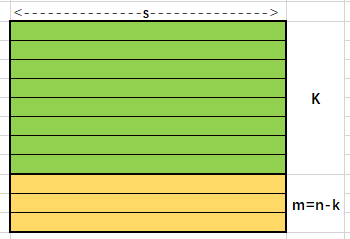
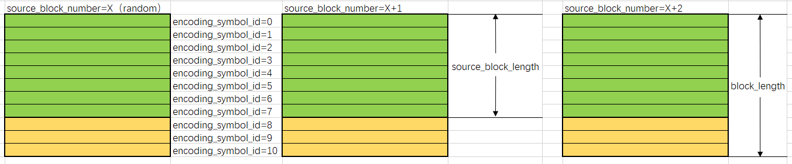

对RS-FEC的RTP打包格式的初步了解，后续发现理解不对的地方，会及时更新。

# 一、名词解释

```
          Input:  k source symbols
    0             u                                S-1
   +-+-+-+-+-+-+-+-+-+-+-+-+-+-+-+-+-+-+-+-+-+-+-+-+-+
   |             |X|                                 | source symbol 0
   +-+-+-+-+-+-+-+-+-+-+-+-+-+-+-+-+-+-+-+-+-+-+-+-+-+
   +-+-+-+-+-+-+-+-+-+-+-+-+-+-+-+-+-+-+-+-+-+-+-+-+-+
   |             |X|                                 | source symbol 1
   +-+-+-+-+-+-+-+-+-+-+-+-+-+-+-+-+-+-+-+-+-+-+-+-+-+
                . . .
   +-+-+-+-+-+-+-+-+-+-+-+-+-+-+-+-+-+-+-+-+-+-+-+-+-+
   |             |X|                                 | source symbol k-1
   +-+-+-+-+-+-+-+-+-+-+-+-+-+-+-+-+-+-+-+-+-+-+-+-+-+

                  *
        +--------------------+
        |  generator matrix  |
        |         GM         |
        |       (k x n)      |
        +--------------------+
                  |
                  V

        Output: n encoding symbols (source + repair)
    0             u                                S-1
   +-+-+-+-+-+-+-+-+-+-+-+-+-+-+-+-+-+-+-+-+-+-+-+-+-+
   |             |X|                                 | enc. symbol 0
   +-+-+-+-+-+-+-+-+-+-+-+-+-+-+-+-+-+-+-+-+-+-+-+-+-+
   +-+-+-+-+-+-+-+-+-+-+-+-+-+-+-+-+-+-+-+-+-+-+-+-+-+
   |             |X|                                 | enc. symbol 1
   +-+-+-+-+-+-+-+-+-+-+-+-+-+-+-+-+-+-+-+-+-+-+-+-+-+
                . . .
   +-+-+-+-+-+-+-+-+-+-+-+-+-+-+-+-+-+-+-+-+-+-+-+-+-+
   |             |Y|                                 | enc. symbol n-1
   +-+-+-+-+-+-+-+-+-+-+-+-+-+-+-+-+-+-+-+-+-+-+-+-+-+

```
图一：FEC编码示意图

1. Source symbol：原始音视频数据。也是FEC编码输入数据。
2. Encoding symbol：FEC编码后生成数据。
3. Repair symbol：FEC编码后数据分两块：前K包数据是原始频数据。后（n-k）包数据，是经RS运算生成的Repair symbol
4. Code rate:k/n，k原始数据包个数。n FEC编码后总包数。0 < code rate <= 1。code rate趋近1，说明冗余度越小。
5. Systematic code：编码里面，source symbols那部分数据。
6. Source Packet：只含有source symbols的RTP报文。
7. Repair Packet：只含有repair symbols的RTP报文。
8. Source block：前面k个source symbols。



图二：FEC编码参数

- k：表示Source symbol数据包个数。
- n：表示FEC编码生成包个数。
- m：表示冗余包个数。

# 二、报文格式

```
   +--------------------------------+
   |           IP Header            |
   +--------------------------------+
   |        Transport Header        |
   +--------------------------------+
   |           RTP Header           |
   +--------------------------------+ ---
   |           FEC Header           |   V
   +--------------------------------+   Rtp Payload
   |           Repair Data          |   ^
   +--------------------------------+----
```

图三：RS-FEC RTP报文格式

```
    0                   1                   2                   3
    0 1 2 3 4 5 6 7 8 9 0 1 2 3 4 5 6 7 8 9 0 1 2 3 4 5 6 7 8 9 0 1
   +-+-+-+-+-+-+-+-+-+-+-+-+-+-+-+-+-+-+-+-+-+-+-+-+-+-+-+-+-+-+-+-+
   |           Source Block Number (24 bits)       | Enc. Symb. ID |
   +-+-+-+-+-+-+-+-+-+-+-+-+-+-+-+-+-+-+-+-+-+-+-+-+-+-+-+-+-+-+-+-+
   |    Source Block Length (k)    |
   +-+-+-+-+-+-+-+-+-+-+-+-+-+-+-+-+
   图5:m=8的源FEC负载ID编码格式（默认值）.

    0                   1                   2                   3
    0 1 2 3 4 5 6 7 8 9 0 1 2 3 4 5 6 7 8 9 0 1 2 3 4 5 6 7 8 9 0 1
   +-+-+-+-+-+-+-+-+-+-+-+-+-+-+-+-+-+-+-+-+-+-+-+-+-+-+-+-+-+-+-+-+
   |   Source Block Nb (16 bits)   |   Enc. Symbol ID (16 bits)    |
   +-+-+-+-+-+-+-+-+-+-+-+-+-+-+-+-+-+-+-+-+-+-+-+-+-+-+-+-+-+-+-+-+
   |    Source Block Length (k)    |
   +-+-+-+-+-+-+-+-+-+-+-+-+-+-+-+-+
   图6:m=16的源FEC负载ID编码格式.
```

图四：RS-FEC RTP包头格式



图五：RS-FEC RTP包参数示意图

- Source Block Number：块序列号，起始值可以是一个随机数，后续每生成一块，该值加一。
- Encoding Symbol ID：一个块中，每个报文的序列号，取值为0-（n-1）。
- Source Block Length：一个块中，原始数据的个数。FEC编码时，固定配置。是图二FEC编码参数的K值。