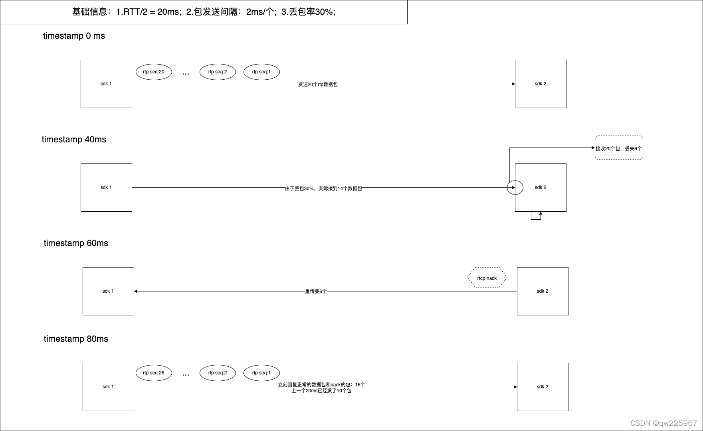

 近期在针对纯丢包场景做一些简单的探索实验，一个让我困扰的问题就是：不使用FEC而只是通过纯NACK进行补偿，到底能在实验环境下抵抗多少的丢包呢？每一次丢包补偿的最大时长是多久呢（一个包在发生丢包状态下补回的时长）？就此问题我展开了一系列的分析和简单的实验demo，demo放在我的github上。

# 一、NACK简介
  ACK是到达通知技术。以TCP为例，他可靠因为接收方在收到数据后会给发送方返回一个“已收到数据”的消息（ACK），告诉发送方“我已经收到了”，确保消息的可靠。

  NACK也是一种通知技术，只是触发通知的条件刚好的ACK相反，在未收到消息时，通知发送方“我未收到消息”，即通知未达。

# 二、Nack的理解
## 2.1 一种补救策略
  nack是常用的丢包补救策略。作为最简单、最常用的补救方式，已经被各大音视频厂商进行了大量的实验和研究。集合 zego、网易云信、百度云等厂商的实现/文章，我们将Nack策略作一些关键归纳。总结起来无非以下几点：什么时候要、要多少、怎么要？

## 2.2 什么时候要？
  nack作为接收方反馈的方式，要达到两个目的：
   ■ 及时找上行要丢失的数据；
   ■ 优先要最重要的数据。
  因此在设计上，我们需要：数据新旧的时序性、旧数据淘汰机制、关键数据的识别机制。在数据丢失的第一时间甚至只是乱序到达我们都开始去做重传。

## 2.3 要多少？
  nack是rtcp数据，属于控制信息。信令在整个传输中流量的占比应该严格控制，目前网络的做法，rtcp信令可能只占到整体流量的5%左右，xx公司则是会达到近10%的占比（包含了各类带宽估计的feedback），而某著名媒体服务商也达到了12%。每个nack数据包最大也只为网络传输的MTU大小（1500字节），如果按20ms的定时要nack，传输数据量每秒50个包，每个包可以携带约300 ~ 400个seq（xx公司是347个）。因此计算得到一秒最大可以要将近15000 ~ 20000个数据包。往往我们1.2m的码率每秒也只有500 - 600个包，因此我们在整个传输中间我们向上行索要seq号有部分是重复的。
  经验归纳出来：
  ■ 在带宽允许的情况下，要保证能补就补，尽量延迟超时机制；
  ■ 在索要seq的数量上做一个最大的控制量，某著名媒体服务商在70%丢包的环境下会索要最高达27次。

## 2.4 怎么要？
  nack请求哪些seq也是非常重要的。我们常用的会分为两类：
   ■ 视频数据：关键帧、非关键帧
   ■ 音频数据。关键帧数据肯定是需要更多优先级倾斜的，相比于普通数据，他要的次数更多，大约多40%。而音频数据较小，在整体传输中流畅率是比较好保证的，因此即使维持在普通传输的重传频率上依然能保证较好的流畅性。
同时，请求的时机也很关键，实验证明，前松后紧的策略可以有效提高抗丢包性能（前面要的频率低，如果还没补上则越要越快）

# 三、计算分析
## 3.1 rtt强相关

  上图的过程是一个假设在30%数据丢包率，40ms定时nack的状态下请求包的过程。
   ■ 时间为0ms的时候：sdk1发送20个数据包，sdk2因为丢包30%接到了14个；
   ■ 等待40ms定时器触发时：nack里的seq有6个；
   ■ 到60ms时：sdk1接到了sdk2的nack信令，立刻传出6个数据包；
   ■ 80ms时：sdk1再次发出16个数据包（10个正常数据+6个丢包数据），但实际到达sdk2的又少了5个——11个。通过计算可知，其中nack索要的包再次丢失的概率为11%。（向上取整的方式）

## 3.2 补包次数计算
  (不做重传限制)计算：16 x 30% x 6/16 ≈ 2个。这2个包可能再次丢失，加入到下次的重传过程中。也就是下次重传会有6个本次丢失的流数据包和2个前一次丢失的数据包，也就是8个。按这个累计计算，下次再丢失第一个的概率是：18 x 30% x 2/18 ≈ 1个。最后会再重传一次，也就是时间戳0ms的数据可能经过3次重传才能理论上完全补上，因此是：160ms时长，最少三次重传，才能保证在30%丢包的网络中实现补包。
  （有一个rtt的重传限制的话），那么很有可能二次丢失的包会再次时延一个rtt之后再重传，可能会导致时延增大。
虽然理论上最少使用3次重传就可以抵抗30%丢包，但实际测试中，往往有部分数据会消耗更多的重传次数，而大部分数据可以在2次重传就补回。

## 3.3 Nack的定时发送
提示：此处讨论的是定时做nack重传的方式，而非丢失立即重传的方式。（该方式在webrtc中使用）

  我们可知，nack定时器的时间40ms和RTT时间是一致的时候我们可以保证在3次重传下抵抗30%的丢包。线上一般rtt可能小于40ms，如果定时器继续维持40ms则有可能导致不能及时重传数据。因此在nack定时器的粒度上我们应该尽量维持较细的粒度，然后通过重传时间计算该次是否需要重传对应的seq数据。

## 3.4 nack重传限制
  数据是连续性到达，我们对哪些数据该发应该做接收时间记录。比如刚加入丢失队列的数据，理应等待一段时间再重传，这样就可能卡在我们定时器的最后时刻导致该包多等待一个周期。（以上图为例，这段可以这么理解：发包间隔是2ms，那么理论上下一个包到达的速度应该是2ms，当他能连续在RTT/10(2ms) ~ RTT/2(20ms)的时间内到达是正常的，当大于 RTT/2可能已经丢失，如果等到一个RTT的时间则太长了，此时实时性就会变差）。
同时，重传应该分为两种情况讨论：
   ■ 第一次丢失：我应该给予网络更多的宽容度，因为乱序到达的情况也不少，因此一般第一次丢失的情况会给RTT/2 ~ RTT的限制时间
   ■ 重复丢失：当重复丢失时我们应该意识到，重传的包在来的路上再次丢失或者我们回复的nack丢失了，无论如何我们都要尽快地去补回包，因此逐渐加快我们的频率，至少是于RTT/2或者是小于RTT/2的频率。这样虽然我们可能多发了一次nack，但是会抵抗二次丢包造成的可能，也就是把第三次丢包的发生概率降低。

# 四、实验
  我们实现一个发送端和接收端。发送端的功能是：不断发送序号为1-65535，大小1400的假数据包。接收端实现nack的逻辑，大致的逻辑是和mediasoup中的nack类似。具体的代码可以查看我的github：https://github.com/qw225967/transport-demo。
  这里列一下大致的nack代码，同时列出关键的影响因素：
   ■ nack定时器——单位ms；
   ■ nack限制间隔——单位ms（一般是rtt）；

```
/*******************************************************
 * @author      : dog head
 * @date        : Created in 2022/3/2 1:52 下午
 * @mail        : qw225967@github.com
 * @project     : receiver
 * @file        : nack_gen.cpp
 * @description : TODO
 *******************************************************/

#include "nack_gen.h"
#include "pack.h"
#include "test_tp.h"

namespace transportdemo {
  /* Static. */

  constexpr size_t MaxPacketAge{ 10000u };
  constexpr size_t MaxNackPackets{ 1000u };
  constexpr uint32_t DefaultRtt{ 100u };
  //	constexpr uint8_t MaxNackRetries{ 10u };
  //	constexpr uint64_t TimerInterval{ 40u };

  // =================== nack test ===================
  constexpr uint8_t MaxNackRetries{ 20u };
  constexpr uint64_t TimerInterval{ 20u };
  // =================== nack test ===================

  /* Instance methods. */

  NackGenerator::NackGenerator() : rtt(DefaultRtt) {
  }

  NackGenerator::~NackGenerator() {
  }

  // Returns true if this is a found nacked packet. False otherwise.
  bool NackGenerator::ReceivePacket(TESTTPPacketPtr packet) {
    TESTTPHeader* header = reinterpret_cast<TESTTPHeader *>(packet->mutable_buffer());
    uint16_t seq    = header->get_sequence();

    if (!this->started) {
      this->started = true;
      this->lastSeq = seq;

      return false;
    }

    // Obviously never nacked, so ignore.
    if (seq == this->lastSeq)
      return false;

    // May be an out of order packet, or already handled retransmitted packet,
    // or a retransmitted packet.
    if (SeqLowerThan(seq, this->lastSeq)) {
      auto it = this->nackList.find(seq);

      // It was a nacked packet.
      if (it != this->nackList.end()) {
        this->nackList.erase(it);

        return true;
      }

      return false;
    }

    AddPacketsToNackList(this->lastSeq + 1, seq);
    this->lastSeq = seq;

    return false;
  }

  void NackGenerator::AddPacketsToNackList(uint16_t seqStart, uint16_t seqEnd) {

    // Remove old packets.
    auto it = this->nackList.lower_bound(seqEnd - MaxPacketAge);

    this->nackList.erase(this->nackList.begin(), it);

    // If the nack list is too large, remove packets from the nack list until
    // the latest first packet of a keyframe. If the list is still too large,
    // clear it and request a keyframe.
    uint16_t numNewNacks = seqEnd - seqStart;

    if (this->nackList.size() + numNewNacks > MaxNackPackets)
    {
      if (this->nackList.size() + numNewNacks > MaxNackPackets)
      {
        this->nackList.clear();

        return;
      }
    }

    for (uint16_t seq = seqStart; seq != seqEnd; ++seq)
    {
      if (this->nackList.find(seq) == this->nackList.end())
        this->nackList.emplace(std::make_pair(seq, NackInfo{ seq, seq, 0, 0 }));
    }
  }

  double CalculateRttLimit2SendNack(int tryTimes) {
    return tryTimes < 3 ?  (double)(tryTimes*0.4) + 1 : 2;
  }

  std::vector<uint16_t> NackGenerator::GetNackBatch() {
    uint64_t nowMs = GetCurrentStamp64();
    NackFilter filter = NackFilter::TIME;
    std::vector<uint16_t> nackBatch;

    auto it = this->nackList.begin();

    while (it != this->nackList.end()) {
      NackInfo& nackInfo = it->second;
      uint16_t seq       = nackInfo.seq;
      
      auto limit_var = uint64_t( this->rtt / CalculateRttLimit2SendNack(nackInfo.retries) );

      if (filter == NackFilter::TIME && nowMs - nackInfo.sentAtMs >= limit_var) {

//      if (filter == NackFilter::TIME && nowMs - nackInfo.sentAtMs >= this->rtt) {
        nackBatch.emplace_back(seq);
        nackInfo.retries++;
        auto oldMs = nackInfo.sentAtMs;
        if (oldMs == 0){
          oldMs = nowMs;
        }

        nackInfo.sentAtMs = nowMs;
        std::cout << "retry seq:" << seq << ", times:" << unsigned(nackInfo.retries) << ", interval:" << nowMs-oldMs << std::endl;
        if (nackInfo.retries >= MaxNackRetries) {
          it = this->nackList.erase(it);
        } else {
          ++it;
        }

        continue;
        }

      ++it;
    }
    return nackBatch;
  }

  void NackGenerator::Reset() {
    this->nackList.clear();
    this->started = false;
    this->lastSeq = 0u;
  }
} // namespace transport-demo

```

## 4.1 实验参数：
   弱网参数：20%随机丢包率+70ms（rtt）。
   ■ 方案一：定时40ms触发一次nack信令发送定时器，再次发送限制为：一个rtt时长。
   ■ 方案二：定时20ms触发一次nack信令发送定时器，再次发送限制为：动态变化，随着重传次数增加而增加：0.7rtt——>0.6rtt——>0.5*rtt 随后稳定。

  这样设计的目的是为了缩短包补偿的间隔，降低卡顿率。

## 4.2 方案一结果：

如图中， 序号为：11741 —— 11496 中：约245个包。
  发生丢包的记录为：63 条。
    一次重传：46条，占比18.77%；
    二次重传：15条，占比6.12%，卡顿时长：80+35(rtt/2) = 115ms ；
    三次重传：2条，占比0.81%，卡顿时长：120+80+35(rtt/2) = 235ms；

## 4.3 方案二结果：

如图中， 序号为：1433 —— 1720 中：约287个包。

  发生丢包的记录为：63 条。
    一次重传：58条，占比20.2%；
    二次重传：3条，占比1.04%，卡顿时长：60+35(rtt/2) = 95ms；
    三次重传：1条，占比0.35%，卡顿时长：60+60+35(rtt/2) = 155ms；
    四次重传：1条，占比0.35%，卡顿时长：60+60+60+35(rtt/2) = 215ms；

## 4.4 结果分析
  1.我们通过加快发送nack的频率，缩短了补包时间。在同样重传3次的情况下，我们可以缩短将近80ms的延迟；
  2.第二方案的实现中我们可以看到，即使发生了4次重传，也比之前235ms的耗时更小，而且这种表现在高延迟环境下会体现更明显。

# 五、总结
  在音视频传输中，使用纯nack方案来做丢包补偿是不能满足所有需求的。上述20%丢包环境下，发生3次重复性丢包的概率已经不低，假设我们不惜代价（牺牲带宽）地增大nack量。收获的效果其实并不会很好，因为不断发生的重复丢包会导致我们补包的稳定性不高。时长时短的到达包就会造成我们画面类似于ppt般的卡顿。
  因此对于纯nack方案的最佳性能，实际应用中并不理想。那么现阶段非常流行的fec+nack是如何将我们的网络质量提高到抗70%丢包并无感知的？实际就是通过不断平和fec（前向纠错）与nack的配比来实现的（即使如此，使用fec+nack也会消耗带宽为原流2倍以上的带宽才实现的）。后续我将会结合fec和nack来做一些实验FEC的实践奥秘，看看fec是如何有效的实现弱网抵抗的。那么这篇文章就到这里结束，感兴趣的同学也可以下载我nack 的demo测试一下，也许会发现更有意思的东西。